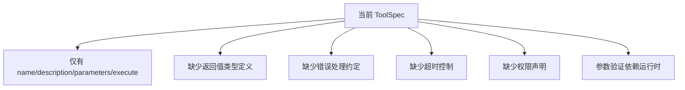
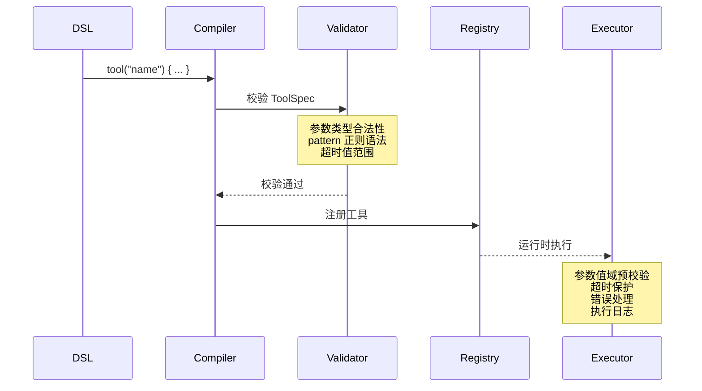
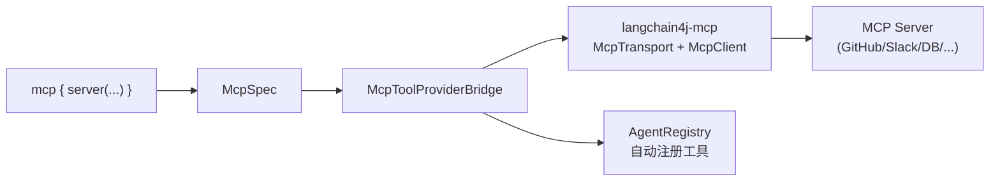
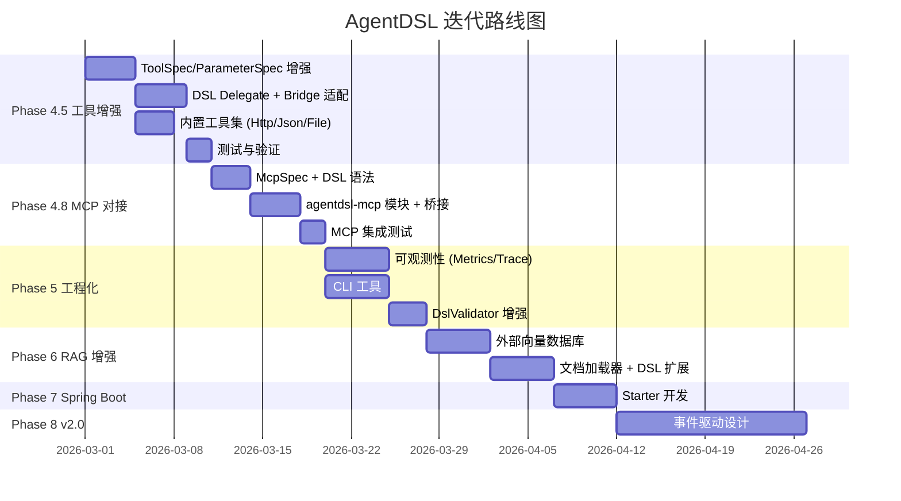

# AgentDSL 系统优化与迭代计划

> 基于 2026-02-26 对系统现状的全面代码审查和工具定义讨论，制定以下优化与迭代路线图。

---

## 1. 现状评估

### 已完成

| 阶段    | 内容                                              | 状态       |
| ------- | ------------------------------------------------- | ---------- |
| Phase 0 | DSL 语言规范 v1.0 + v1.1                          | ✅          |
| Phase 1 | 核心骨架：Spec 模型、Groovy 编译器、安全沙箱      | ✅          |
| Phase 2 | LangChain4j 集成：模型工厂、记忆工厂、工具桥接    | ✅          |
| Phase 3 | 热加载、`@AgentTool` 注解扫描、内联工具定义       | ✅          |
| Phase 4 | 工作流 DSL 解析 + 执行引擎（顺序/并行/条件/循环） | ✅ 基础实现 |

### 待优化与未完成

- [ ] 工具定义系统缺乏**类型安全**和**验证机制**
- [ ] 内置通用工具集（`agentdsl-tools`）仅有 `ToolScanner`，缺少 `HttpTool`、`DatabaseTool` 等
- [ ] **不支持 MCP（Model Context Protocol）**，无法接入开源工具生态
- [ ] RAG 仅支持内存嵌入存储，不支持外部向量数据库
- [ ] 无 Spring Boot Starter 集成
- [ ] 无 CLI 工具
- [ ] 无可观测性（Metrics / Tracing）
- [ ] 工作流错误处理和重试机制不完善
- [ ] 多 Agent 事件驱动协作（v2.0）未启动

---

## 2. 工具定义系统优化（核心议题）

工具系统是 Agent 与外部世界交互的唯一通道，其设计质量直接影响系统可用性和安全性。

### 2.1 当前问题分析



| 问题                           | 影响                         | 优先级 |
| ------------------------------ | ---------------------------- | ------ |
| `execute` 闭包无返回值类型约束 | LLM 无法准确理解工具输出格式 | 🔴 高   |
| 参数仅做类型映射，无值域校验   | 运行时错误难以调试           | 🔴 高   |
| 工具无超时控制                 | 长时间阻塞可导致工作流hang   | 🔴 高   |
| 无工具执行日志/指标            | 无法监控和调试               | 🟡 中   |
| 工具间无依赖声明               | 复杂工具链难以管理           | 🟢 低   |

### 2.2 工具定义增强方案

#### 新增 DSL 语法

```groovy
tool("orderQuery") {
    description "查询订单详情"

    // 【新增】返回值类型描述 — 帮助 LLM 理解输出格式
    returns "string", "JSON 格式的订单信息，包含 orderId, status, items 字段"

    // 【新增】超时控制
    timeout 10  // 秒

    // 【新增】权限声明 — 工具需要的外部访问能力
    permissions {
        network "https://api.example.com/*"
        // database "orders"  // 预留
    }

    // 【增强】参数增加值域约束
    parameter {
        name "orderId"
        type "string"
        description "订单 ID，格式为 ORD-xxxx"
        required true
        pattern "ORD-\\d{4,10}"       // 【新增】正则校验
    }

    parameter {
        name "includeItems"
        type "boolean"
        description "是否包含订单项详情"
        required false
        defaultValue true             // 【新增】默认值
    }

    // 【新增】错误处理
    onError { error ->
        return "查询失败: ${error.message}"
    }

    execute { params ->
        // 实际执行逻辑
    }
}
```

#### Spec 模型变更

```diff
// ToolSpec.java
+ private String returnType;
+ private String returnDescription;
+ private Integer timeoutSeconds;
+ private Object onErrorHandler;
+ private Map<String, String> permissions;

// ParameterSpec.java
+ private String pattern;
+ private Object defaultValue;
+ private String enumValues;       // 枚举约束 "a,b,c"
+ private Double min;              // 数值范围
+ private Double max;
```

#### LangChainToolBridge 增强

- 向 `ToolSpecification` 添加返回值描述（嵌入 description）
- 工具执行时增加参数预校验（正则、范围、枚举）
- 工具执行增加超时保护（`CompletableFuture.orTimeout()`）
- 错误处理闭包兜底

### 2.3 工具生命周期管理



---

## 3. 分阶段迭代路线图

### Phase 4.5：工具系统深化（2 周）

> [!IMPORTANT]
> 这是下一步最高优先级工作，直接提升系统的实用性和健壮性。

| 任务                                                                  | 涉及模块               | 预估工作量 |
| --------------------------------------------------------------------- | ---------------------- | ---------- |
| ToolSpec/ParameterSpec 增加返回值、超时、校验等字段                   | `agentdsl-core`        | 2d         |
| DSL Delegate 支持新语法（`returns`, `timeout`, `pattern`, `onError`） | `agentdsl-core`        | 2d         |
| LangChainToolBridge 增加参数预校验 + 超时保护 + 错误处理              | `agentdsl-langchain4j` | 2d         |
| 内置工具集实现：`HttpTool`、`JsonTool`、`FileTool`                    | `agentdsl-tools`       | 3d         |
| 编写单元测试和集成测试                                                | 各模块                 | 2d         |

**具体增强：**

1. **`ToolSpec` 增强**
   - 新增 `returnType`, `returnDescription` 字段
   - 新增 `timeoutSeconds` 字段（默认 30s）
   - 新增 `onErrorHandler` 闭包字段
   - 新增 `permissions` Map

2. **`ParameterSpec` 增强**
   - 新增 `pattern`（正则校验字符串）
   - 新增 `defaultValue`（Object 类型默认值）
   - 新增 `enumValues`（逗号分隔的枚举值列表）
   - 新增 `min`, `max`（数值范围约束）

3. **DSL Delegate 扩展**
   - `ToolDelegate` 增加 `returns()`, `timeout()`, `onError()`, `permissions()` 方法
   - `ParameterDelegate` 增加 `pattern()`, `defaultValue()`, `enumValues()`, `min()`, `max()` 方法

4. **LangChainToolBridge 增强**
   - 在执行前对参数做校验（正则、范围、枚举、必填+默认值回填）
   - 工具执行增加 `CompletableFuture.orTimeout()` 超时机制
   - 工具 description 自动追加返回值格式说明
   - 执行失败时调用 `onError` 闭包兜底

5. **内置工具集**
   - `HttpTool`：HTTP GET/POST 请求，支持 header 和 body
   - `JsonTool`：JSON 解析/格式化/路径查询
   - `FileTool`：受限的文件读写（白名单目录内）

### Phase 4.8：MCP 协议对接（1.5 周）

> [!IMPORTANT]
> MCP 是工具系统的「乘数效应」——通过对接 MCP Server 生态，DSL 可立即获得数百个现成工具（GitHub、Slack、Postgres、文件系统等），无需逐个开发。

**核心思路：** AgentDSL 作为 **MCP Client**，借助 LangChain4j 已有的 `langchain4j-mcp` 模块（支持 STDIO / HTTP SSE / WebSocket / Docker 传输），实现 DSL 声明式对接 MCP Server。

| 任务                                             | 涉及模块             | 预估工作量 |
| ------------------------------------------------ | -------------------- | ---------- |
| 新增 `McpSpec` 模型 + `McpDelegate` DSL 语法     | `agentdsl-core`      | 2d         |
| 新增 `agentdsl-mcp` 模块，集成 `langchain4j-mcp` | `agentdsl-mcp` [NEW] | 3d         |
| `McpToolProvider` → ToolSpec/ToolExecutor 桥接   | `agentdsl-mcp`       | 2d         |
| `AgentDslEngine` 集成 MCP 生命周期管理           | `agentdsl-runtime`   | 1d         |
| 端到端测试 + MCP Server 示例脚本                 | 各模块               | 2d         |

**DSL 语法设计：**

```groovy
// 方式一：Agent 内挂载 MCP Server
agent("dev-assistant") {
    model { provider "openai"; modelName "gpt-4" }

    mcp {
        // STDIO 方式：启动本地 MCP Server 进程
        server("github") {
            transport "stdio"
            command "npx", "-y", "@modelcontextprotocol/server-github"
            env "GITHUB_TOKEN", env("GITHUB_TOKEN")
        }

        // HTTP/SSE 方式：连接远程 MCP Server
        server("database") {
            transport "http"
            url "http://localhost:3001/mcp"
        }

        // 可选：只暴露部分工具给 Agent
        filterTools "get_issue", "list_issues", "create_issue"
    }
}
```

**技术实现路径：**



---

### Phase 5：可观测性 & 工程化（2 周）

| 任务              | 说明                                                                     |
| ----------------- | ------------------------------------------------------------------------ |
| 工具执行指标采集  | 执行次数、耗时、成功率、错误分布                                         |
| 工作流可观测性    | 步骤级别的执行 trace、输入输出日志                                       |
| 结构化日志增强    | 统一日志格式（JSON），方便接入 ELK/Loki                                  |
| DslValidator 增强 | 编译期更严格的语义校验（工具引用存在性、类型兼容性）                     |
| CLI 工具开发      | `agentdsl run script.agent.groovy`、`agentdsl validate`、`agentdsl list` |

### Phase 6：RAG 系统增强（2 周）

| 任务               | 说明                                   |
| ------------------ | -------------------------------------- |
| 外部向量数据库支持 | Chroma、Milvus、PostgreSQL/pgvector    |
| 文档加载器         | PDF、Markdown、HTML 文档的分段加载     |
| 嵌入模型多Provider | OpenAI embedding、DashScope embedding  |
| RAG DSL 语法扩展   | `documents { }` 块指定数据源和分段策略 |

**RAG DSL 扩展示例：**

```groovy
agent("doc-assistant") {
    model { provider "openai"; modelName "gpt-4" }

    rag {
        documents {
            source "./docs/"           // 文档目录
            fileTypes "md", "pdf"      // 文件类型过滤
            chunkSize 500              // 分段大小
            chunkOverlap 50           // 分段重叠
        }

        contentRetriever {
            type "chroma"              // 外部向量数据库
            collectionName "my-docs"
            embeddingModel "text-embedding-3-small"
            maxResults 5
            minScore 0.7
        }
    }
}
```

### Phase 7：Spring Boot 集成（1 周）

| 任务                                | 说明                                                       |
| ----------------------------------- | ---------------------------------------------------------- |
| `agentdsl-spring-boot-starter` 模块 | 自动装配，扫描 `classpath:agents/` 目录                    |
| `@EnableAgentDsl` 注解              | 启用 DSL 引擎 + 热加载                                     |
| REST API 自动暴露                   | `/api/agents/{name}/chat`、`/api/workflows/{name}/execute` |
| `application.yml` 配置              | 全局模型默认值、沙箱开关、热加载配置                       |

### Phase 8：v2.0 多 Agent 事件驱动协作（3 周）

> [!NOTE]
> 这是系统从「编排引擎」演进为「协作平台」的关键里程碑。

| 任务                             | 说明                        |
| -------------------------------- | --------------------------- |
| 事件总线设计                     | Agent 间的发布/订阅消息机制 |
| `event` / `subscribe` DSL 关键字 | 声明式事件定义              |
| Agent 间共享记忆                 | 协作上下文管理              |
| 事件溯源日志                     | 完整的事件链追踪            |

**事件驱动 DSL 示例（v2.0 预览）：**

```groovy
agent("order-processor") {
    model { provider "openai"; modelName "gpt-4" }

    subscribe("order.created") { event ->
        // 处理新订单事件
        def result = process(event.data)
        emit("order.processed", result)
    }
}

agent("notification-agent") {
    model { provider "ollama"; modelName "qwen2.5" }

    subscribe("order.processed") { event ->
        // 发送通知
        notify(event.data.customerEmail)
    }
}
```

---

## 4. 优先级排序总结



| 阶段                         | 优先级 | 核心价值                                        |
| ---------------------------- | ------ | ----------------------------------------------- |
| **Phase 4.5** 工具系统深化   | 🔴 P0   | 工具是 Agent 的核心能力，直接影响可用性         |
| **Phase 4.8** MCP 协议对接   | 🔴 P0   | 乘数效应，接入开源工具生态数百个现成 MCP Server |
| **Phase 5** 可观测性&工程化  | 🟠 P1   | 生产级使用的必要基础设施                        |
| **Phase 6** RAG 增强         | 🟡 P2   | 知识化 Agent 的核心能力                         |
| **Phase 7** Spring Boot 集成 | 🟡 P2   | 降低 Java 生态接入门槛                          |
| **Phase 8** v2.0 事件驱动    | 🟢 P3   | 架构升级，长期价值                              |

---

## 5. 技术债务清理

在迭代过程中同步清理以下技术债务：

| 债务项                                       | 位置                   | 建议措施                                |
| -------------------------------------------- | ---------------------- | --------------------------------------- |
| `ToolSpec.executeBody` 声明为 `Object`       | `agentdsl-core`        | 引入泛型或接口 `ToolExecuteBody`        |
| `LangChainRagFactory` 硬编码 AllMiniLm 模型  | `agentdsl-langchain4j` | 通过 `embeddingModel` 字段动态选择      |
| `AgentExecutor` 工具调用循环最大 10 次硬编码 | `agentdsl-runtime`     | 可配置化，提升至 `AgentSpec` 或全局配置 |
| `WorkflowExecutor` 并行步骤线程池未配置      | `agentdsl-runtime`     | 由外部注入或 DSL 配置                   |
| 缺少 `DslCompileResult` 的错误聚合           | `agentdsl-compiler`    | 增加编译诊断信息（warnings + info）     |
| `convertArg` 基本类型转换不完整              | `agentdsl-langchain4j` | 增加 `BigDecimal`、枚举等类型支持       |

---

## 6. 下一步行动建议

1. **立即启动 Phase 4.5**：工具定义增强是最迫切的优化点，建议在 1-2 周内集中完成
2. **优先实现 `HttpTool`**：这是 Agent 最常用的外部交互工具，可作为内置工具集的第一个实现
3. **补充集成测试**：当前测试覆盖度不足，尤其是工具执行、工作流端到端场景
4. **考虑引入配置文件**：全局默认配置（默认 provider、超时、沙箱开关等）应从 DSL 中分离出来