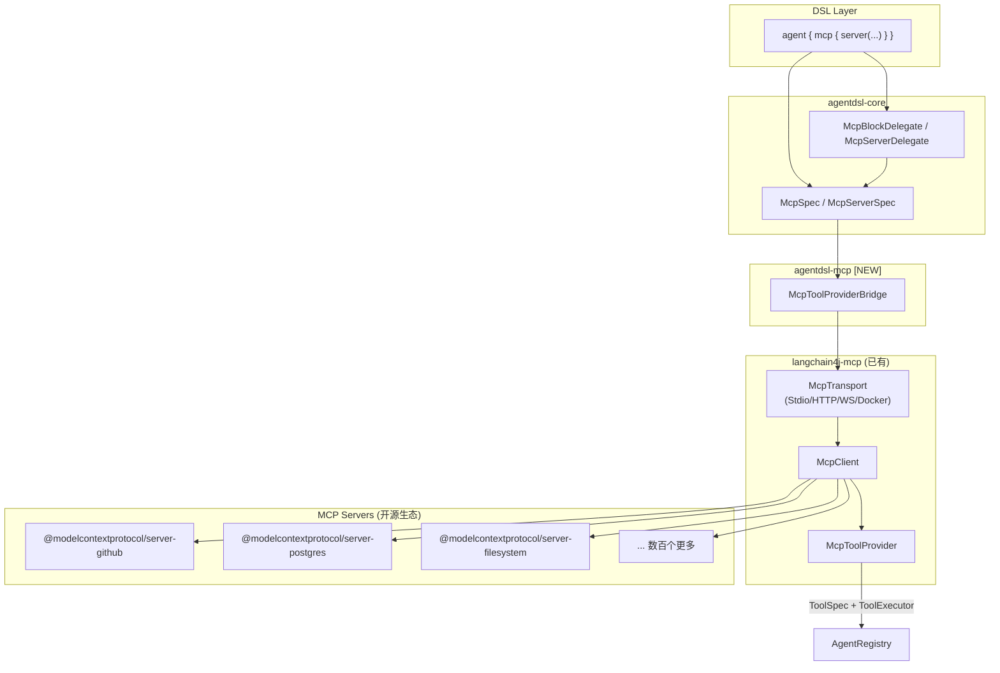
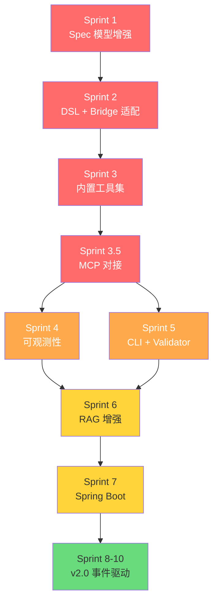

# AgentDSL 迭代开发计划 — 任务分解

> 基于 [AgentDSL 系统优化与迭代计划](file:///Users/wuguirong/sourceCode/AgentDSL/doc/AgentDSL%20系统优化与迭代计划.md) 进行 Sprint 级任务拆分。
> 每个 Sprint 为 **1 周**，每个任务标注所属模块、估算工时、验收标准。

---

## 总览

```mermaid
graph LR
    S1["Sprint 1<br/>ToolSpec 模型增强"]
    S2["Sprint 2<br/>DSL 语法 + Bridge 适配"]
    S3["Sprint 3<br/>内置工具集 + 集成测试"]
    S35["Sprint 3.5<br/>MCP 协议对接"]
    S4["Sprint 4<br/>可观测性 + 结构化日志"]
    S5["Sprint 5<br/>CLI 工具 + Validator 增强"]
    S6["Sprint 6<br/>RAG 系统增强"]
    S7["Sprint 7<br/>Spring Boot Starter"]
    S8["Sprint 8-10<br/>v2.0 事件驱动"]

    S1 --> S2 --> S3 --> S35 --> S4 --> S5 --> S6 --> S7 --> S8
```



| Sprint      | 主题                                    | 对应阶段  | 时间       | 是否完成 ｜ |
| ----------- | --------------------------------------- | --------- | ---------- | ----------- |
| Sprint 1    | ToolSpec/ParameterSpec 模型增强         | Phase 4.5 | Week 1     | 是 ｜       |
| Sprint 2    | DSL Delegate + LangChainToolBridge 适配 | Phase 4.5 | Week 2     | 是 ｜       |
| Sprint 3    | 内置工具集 + 端到端集成测试             | Phase 4.5 | Week 3     | 是 ｜       |
| Sprint 3.5  | **MCP 协议对接**                        | Phase 4.8 | Week 3.5-4 | 是 ｜       |
| Sprint 4    | 可观测性 + 结构化日志                   | Phase 5   | Week 5     | 是 ｜       |
| Sprint 5    | CLI 工具 + DslValidator 增强            | Phase 5   | Week 6     | 是 ｜       |
| Sprint 6    | RAG 系统增强                            | Phase 6   | Week 7-8   | 否 ｜       |
| Sprint 7    | Spring Boot Starter                     | Phase 7   | Week 9     | 否 ｜       |
| Sprint 8-10 | v2.0 事件驱动多 Agent                   | Phase 8   | Week 10-12 | 否 ｜       |

---

## Sprint 1：ToolSpec / ParameterSpec 模型增强

**目标：** 扩展核心 Spec 模型，为工具定义系统增加类型安全和验证能力的数据基础。

### 任务清单

| #   | 任务                                    | 模块                | 文件                                                                                                                                     | 工时 | 优先级 |
| --- | --------------------------------------- | ------------------- | ---------------------------------------------------------------------------------------------------------------------------------------- | ---- | ------ |
| 1.1 | `ToolSpec` 新增字段                     | `agentdsl-core`     | [ToolSpec.java](file:///Users/wuguirong/sourceCode/AgentDSL/agentdsl-core/src/main/java/com/agentdsl/core/spec/ToolSpec.java)            | 2h   | P0     |
| 1.2 | `ParameterSpec` 新增字段                | `agentdsl-core`     | [ParameterSpec.java](file:///Users/wuguirong/sourceCode/AgentDSL/agentdsl-core/src/main/java/com/agentdsl/core/spec/ParameterSpec.java)  | 2h   | P0     |
| 1.3 | 新增 `PermissionSpec` 模型              | `agentdsl-core`     | `spec/PermissionSpec.java` [NEW]                                                                                                         | 1h   | P1     |
| 1.4 | `DslValidator` 增加工具校验规则         | `agentdsl-compiler` | [DslValidator.java](file:///Users/wuguirong/sourceCode/AgentDSL/agentdsl-compiler/src/main/java/com/agentdsl/compiler/DslValidator.java) | 3h   | P0     |
| 1.5 | 单元测试：Spec 模型                     | `agentdsl-core`     | `test/`                                                                                                                                  | 2h   | P0     |
| 1.6 | 技术债务：`ToolSpec.executeBody` 类型化 | `agentdsl-core`     | ToolSpec.java                                                                                                                            | 1h   | P2     |

### 详细描述

#### 1.1 ToolSpec 新增字段

```java
// 新增字段
private String returnType;              // 返回值类型 ("string", "json", "object")
private String returnDescription;       // 返回值格式描述
private Integer timeoutSeconds = 30;    // 执行超时（秒），默认 30s
private Object onErrorHandler;          // Groovy Closure，错误处理回调
private PermissionSpec permissions;     // 权限声明
```

#### 1.2 ParameterSpec 新增字段

```java
// 新增字段
private String pattern;                 // 正则校验表达式
private Object defaultValue;            // 参数默认值
private String enumValues;              // 枚举约束 "value1,value2,value3"
private Double min;                     // 数值最小值
private Double max;                     // 数值最大值
```

#### 1.3 PermissionSpec [NEW]

```java
public class PermissionSpec {
    private List<String> networkPatterns;   // 允许的网络访问 URL 通配符
    private List<String> filePatterns;      // 允许的文件路径通配符
    private List<String> databases;         // 允许访问的数据库名
}
```

#### 1.4 DslValidator 增加工具校验

- 校验 `pattern` 是合法的正则表达式
- 校验 `min` ≤ `max`（如果同时设置）
- 校验 `timeoutSeconds` > 0 且 ≤ 300
- 校验 `enumValues` 不为空字符串
- 校验 `returnType` 在合法值列表内

### 验收标准

- [ ] `ToolSpec` / `ParameterSpec` 新字段均有 getter/setter
- [ ] `PermissionSpec` 模型可正常序列化
- [ ] `DslValidator` 对非法 pattern、超时值等能正确抛出 `DslCompilationException`
- [ ] 所有新增字段有对应的单元测试
- [ ] 现有测试全部通过：`./gradlew :agentdsl-core:test :agentdsl-compiler:test`

---

## Sprint 2：DSL Delegate + LangChainToolBridge 适配

**目标：** DSL 语法层和 LangChain4j 桥接层适配新的 ToolSpec 字段，用户可在 DSL 中使用新语法。

### 任务清单

| #   | 任务                                        | 模块                   | 文件                                                                                                                                                                 | 工时 | 优先级 |
| --- | ------------------------------------------- | ---------------------- | -------------------------------------------------------------------------------------------------------------------------------------------------------------------- | ---- | ------ |
| 2.1 | `ToolDelegate` 增加新 DSL 方法              | `agentdsl-core`        | [ToolDelegate.groovy](file:///Users/wuguirong/sourceCode/AgentDSL/agentdsl-core/src/main/groovy/com/agentdsl/core/dsl/ToolDelegate.groovy)                           | 3h   | P0     |
| 2.2 | `ParameterDelegate` 增加新 DSL 方法         | `agentdsl-core`        | [ParameterDelegate.groovy](file:///Users/wuguirong/sourceCode/AgentDSL/agentdsl-core/src/main/groovy/com/agentdsl/core/dsl/ParameterDelegate.groovy)                 | 2h   | P0     |
| 2.3 | 新增 `PermissionDelegate`                   | `agentdsl-core`        | `dsl/PermissionDelegate.groovy` [NEW]                                                                                                                                | 1h   | P1     |
| 2.4 | `LangChainToolBridge` 参数预校验            | `agentdsl-langchain4j` | [LangChainToolBridge.java](file:///Users/wuguirong/sourceCode/AgentDSL/agentdsl-langchain4j/src/main/java/com/agentdsl/langchain4j/LangChainToolBridge.java)         | 3h   | P0     |
| 2.5 | `LangChainToolBridge` 超时保护              | `agentdsl-langchain4j` | LangChainToolBridge.java                                                                                                                                             | 2h   | P0     |
| 2.6 | `LangChainToolBridge` 错误处理 + 返回值描述 | `agentdsl-langchain4j` | LangChainToolBridge.java                                                                                                                                             | 2h   | P0     |
| 2.7 | DSL 解析测试                                | `agentdsl-compiler`    | [DslCompilerTest.java](file:///Users/wuguirong/sourceCode/AgentDSL/agentdsl-compiler/src/test/java/com/agentdsl/compiler/DslCompilerTest.java)                       | 2h   | P0     |
| 2.8 | Bridge 单元测试                             | `agentdsl-langchain4j` | [LangChainToolBridgeTest.java](file:///Users/wuguirong/sourceCode/AgentDSL/agentdsl-langchain4j/src/test/java/com/agentdsl/langchain4j/LangChainToolBridgeTest.java) | 2h   | P0     |
| 2.9 | 技术债务：`convertArg` 类型转换完善         | `agentdsl-langchain4j` | LangChainToolBridge.java                                                                                                                                             | 1h   | P2     |

### 详细描述

#### 2.1 ToolDelegate 新增方法

```groovy
// ToolDelegate.groovy 新增
def returns(String type, String description) { ... }
def timeout(int seconds) { ... }
def onError(Closure handler) { ... }
def permissions(Closure config) { ... }
```

#### 2.2 ParameterDelegate 新增方法

```groovy
// ParameterDelegate.groovy 新增
def pattern(String regex) { ... }
def defaultValue(Object value) { ... }
def enumValues(String... values) { ... }
def min(double value) { ... }
def max(double value) { ... }
```

#### 2.4 参数预校验逻辑

在 `ToolExecutor` lambda 内，执行前增加校验步骤：

```java
private String validateParameters(ToolSpec toolSpec, Map<String, Object> params) {
    for (ParameterSpec paramSpec : toolSpec.getParameters()) {
        Object value = params.get(paramSpec.getName());

        // 1. 必填 + 默认值回填
        if (value == null && paramSpec.getDefaultValue() != null) {
            params.put(paramSpec.getName(), paramSpec.getDefaultValue());
            continue;
        }
        if (value == null && paramSpec.isRequired()) {
            return "Missing required parameter: " + paramSpec.getName();
        }

        // 2. 正则校验
        if (paramSpec.getPattern() != null && value instanceof String) {
            if (!((String) value).matches(paramSpec.getPattern())) {
                return "Parameter '" + paramSpec.getName() + "' does not match pattern: " + paramSpec.getPattern();
            }
        }

        // 3. 数值范围校验
        if (value instanceof Number) {
            double numVal = ((Number) value).doubleValue();
            if (paramSpec.getMin() != null && numVal < paramSpec.getMin()) { ... }
            if (paramSpec.getMax() != null && numVal > paramSpec.getMax()) { ... }
        }

        // 4. 枚举校验
        if (paramSpec.getEnumValues() != null) { ... }
    }
    return null; // 校验通过
}
```

#### 2.5 超时保护

```java
CompletableFuture<String> future = CompletableFuture.supplyAsync(() -> {
    // 执行 Closure 或 Bean 方法
    return executeToolBody(toolSpec, request);
});
try {
    return future.get(toolSpec.getTimeoutSeconds(), TimeUnit.SECONDS);
} catch (TimeoutException e) {
    future.cancel(true);
    return handleTimeout(toolSpec, e);
}
```

### 验收标准

- [ ] DSL 脚本中可使用 `returns`, `timeout`, `pattern`, `defaultValue`, `onError` 等新语法
- [ ] 新语法解析后正确填充到 ToolSpec / ParameterSpec
- [ ] 参数校验：非法正则、超范围值、枚举不匹配时返回错误消息
- [ ] 超时保护：模拟长时间工具执行，验证超时可正常触发
- [ ] 错误处理：`onError` 闭包在工具执行异常时可正确调用
- [ ] 全量测试通过：`./gradlew test`

---

## Sprint 3：内置工具集 + 端到端集成测试

**目标：** 实现常用内置工具，并通过端到端测试验证完整工具链。

### 任务清单

| #   | 任务                                      | 模块               | 文件                                                                                                                                       | 工时 | 优先级 |
| --- | ----------------------------------------- | ------------------ | ------------------------------------------------------------------------------------------------------------------------------------------ | ---- | ------ |
| 3.1 | 实现 `HttpTool`                           | `agentdsl-tools`   | `tools/builtin/HttpTool.java` [NEW]                                                                                                        | 4h   | P0     |
| 3.2 | 实现 `JsonTool`                           | `agentdsl-tools`   | `tools/builtin/JsonTool.java` [NEW]                                                                                                        | 2h   | P1     |
| 3.3 | 实现 `FileTool`                           | `agentdsl-tools`   | `tools/builtin/FileTool.java` [NEW]                                                                                                        | 2h   | P1     |
| 3.4 | 内置工具注册机制                          | `agentdsl-tools`   | `tools/BuiltinToolRegistry.java` [NEW]                                                                                                     | 2h   | P0     |
| 3.5 | `AgentDslEngine` 集成内置工具             | `agentdsl-runtime` | [AgentDslEngine.java](file:///Users/wuguirong/sourceCode/AgentDSL/agentdsl-runtime/src/main/java/com/agentdsl/runtime/AgentDslEngine.java) | 1h   | P0     |
| 3.6 | 工具增强 DSL 示例脚本                     | `examples`         | `examples/enhanced-tools.agent.groovy` [NEW]                                                                                               | 1h   | P1     |
| 3.7 | 单元测试：各内置工具                      | `agentdsl-tools`   | `test/`                                                                                                                                    | 3h   | P0     |
| 3.8 | 集成测试：工具执行端到端                  | `agentdsl-runtime` | `test/`                                                                                                                                    | 3h   | P0     |
| 3.9 | 技术债务：`WorkflowExecutor` 线程池可配置 | `agentdsl-runtime` | WorkflowExecutor.java                                                                                                                      | 1h   | P2     |

### 详细描述

#### 3.1 HttpTool

```java
@AgentTool(name = "http_get", description = "发送 HTTP GET 请求")
public String httpGet(
    @ToolParam(description = "请求 URL") String url,
    @ToolParam(description = "请求头，JSON 格式", required = false) String headers
) { ... }

@AgentTool(name = "http_post", description = "发送 HTTP POST 请求")
public String httpPost(
    @ToolParam(description = "请求 URL") String url,
    @ToolParam(description = "请求体") String body,
    @ToolParam(description = "Content-Type", required = false) String contentType
) { ... }
```

- 使用 `java.net.http.HttpClient`（JDK 11+）
- 内置超时（30s），响应体长度限制（1MB）
- 支持 JSON / Form 类型的 POST

#### 3.2 JsonTool

```java
@AgentTool(name = "json_parse", description = "解析 JSON 字符串")
public String jsonParse(@ToolParam(description = "JSON 字符串") String json) { ... }

@AgentTool(name = "json_query", description = "使用 JSONPath 查询 JSON")
public String jsonQuery(
    @ToolParam(description = "JSON 字符串") String json,
    @ToolParam(description = "JSONPath 表达式") String path
) { ... }
```

#### 3.3 FileTool

```java
@AgentTool(name = "file_read", description = "读取文件内容")
public String fileRead(
    @ToolParam(description = "文件路径") String path
) { ... }

@AgentTool(name = "file_write", description = "写入文件内容")
public String fileWrite(
    @ToolParam(description = "文件路径") String path,
    @ToolParam(description = "写入内容") String content
) { ... }
```

- 仅允许访问白名单目录
- 读取大小限制（默认 100KB）

#### 3.4 内置工具注册

```java
public class BuiltinToolRegistry {
    public static List<ToolSpec> getBuiltinTools() {
        List<ToolSpec> tools = new ArrayList<>();
        tools.addAll(ToolScanner.scan(new HttpTool()));
        tools.addAll(ToolScanner.scan(new JsonTool()));
        tools.addAll(ToolScanner.scan(new FileTool()));
        return tools;
    }
}
```

### 验收标准

- [ ] `HttpTool` 可以发起真实 HTTP 请求（测试使用 httpbin.org 或 mock server）
- [ ] `JsonTool` 可以正确解析和查询 JSON
- [ ] `FileTool` 在白名单内读写正常，白名单外拒绝
- [ ] DSL 中 `include "http_get"` 可引用内置工具
- [ ] 端到端测试：加载示例脚本 → 调用带工具的 Agent → 正确返回
- [ ] 全量测试通过：`./gradlew test`

---

## Sprint 3.5：MCP 协议对接

**目标：** 将 AgentDSL 作为 MCP Client，通过 DSL 声明式语法对接现有 MCP Server 生态，让 Agent 立即获得数百个开源工具能力。

> [!IMPORTANT]
> LangChain4j 1.11+ 已内置 `langchain4j-mcp` 模块，支持 STDIO / HTTP SSE / WebSocket / Docker 四种传输方式，提供 `McpClient`、`McpToolProvider`、`McpToolExecutor`。AgentDSL 只需做 DSL 语法设计 + 桥接层，无需实现底层协议。

### 任务清单

| #      | 任务                                   | 模块                 | 文件                                      | 工时 | 优先级 |
| ------ | -------------------------------------- | -------------------- | ----------------------------------------- | ---- | ------ |
| 3.5.1  | 新增 `McpServerSpec` 模型              | `agentdsl-core`      | `spec/McpServerSpec.java` [NEW]           | 2h   | P0     |
| 3.5.2  | 新增 `McpSpec` 模型（聚合多个 Server） | `agentdsl-core`      | `spec/McpSpec.java` [NEW]                 | 1h   | P0     |
| 3.5.3  | `AgentSpec` 增加 `mcp` 字段            | `agentdsl-core`      | `spec/AgentSpec.java`                     | 0.5h | P0     |
| 3.5.4  | 新增 `McpServerDelegate` DSL Delegate  | `agentdsl-core`      | `dsl/McpServerDelegate.groovy` [NEW]      | 2h   | P0     |
| 3.5.5  | 新增 `McpBlockDelegate` DSL Delegate   | `agentdsl-core`      | `dsl/McpBlockDelegate.groovy` [NEW]       | 2h   | P0     |
| 3.5.6  | `AgentDelegate` 增加 `mcp {}` 方法     | `agentdsl-core`      | `dsl/AgentDelegate.groovy`                | 0.5h | P0     |
| 3.5.7  | 新建 `agentdsl-mcp` 模块 + Gradle 配置 | `agentdsl-mcp` [NEW] | `build.gradle.kts`, `settings.gradle.kts` | 1h   | P0     |
| 3.5.8  | 实现 `McpToolProviderBridge`           | `agentdsl-mcp`       | `mcp/McpToolProviderBridge.java` [NEW]    | 4h   | P0     |
| 3.5.9  | `AgentRegistry` 支持 MCP 工具注册      | `agentdsl-runtime`   | `AgentRegistry.java`                      | 2h   | P0     |
| 3.5.10 | `AgentDslEngine` MCP 生命周期管理      | `agentdsl-runtime`   | `AgentDslEngine.java`                     | 2h   | P0     |
| 3.5.11 | DSL 解析测试：mcp 语法                 | `agentdsl-compiler`  | `test/McpDslParsingTest.java` [NEW]       | 2h   | P0     |
| 3.5.12 | 集成测试：对接真实 MCP Server          | `agentdsl-mcp`       | `test/McpIntegrationTest.java` [NEW]      | 3h   | P0     |
| 3.5.13 | MCP 示例脚本                           | `examples`           | `examples/mcp-github.agent.groovy` [NEW]  | 1h   | P1     |

### 详细描述

#### 3.5.1 McpServerSpec

```java
public class McpServerSpec {
    private String name;                // Server 标识名
    private String transport;           // "stdio" | "http" | "sse" | "websocket" | "docker"
    private List<String> command;       // STDIO 模式的启动命令
    private String url;                 // HTTP/SSE/WebSocket 的 URL
    private String dockerImage;         // Docker 模式的镜像名
    private Map<String, String> env;    // 环境变量
    private Integer timeout;            // 连接超时（秒）
    private boolean logEvents = false;  // 是否记录交互日志
}
```

#### 3.5.2 McpSpec

```java
public class McpSpec {
    private List<McpServerSpec> servers = new ArrayList<>();
    private List<String> filterToolNames;  // 可选：只暴露指定工具
}
```

#### 3.5.5 McpBlockDelegate DSL 语法支持

```groovy
class McpBlockDelegate {
    McpSpec spec = new McpSpec()

    def server(String name, Closure config) {
        def delegate = new McpServerDelegate(name)
        config.delegate = delegate
        config.resolveStrategy = Closure.DELEGATE_FIRST
        config()
        spec.servers.add(delegate.build())
    }

    def filterTools(String... toolNames) {
        spec.filterToolNames = toolNames as List
    }
}
```

#### 3.5.8 McpToolProviderBridge 核心逻辑

```java
public class McpToolProviderBridge {

    /**
     * 根据 McpSpec 创建 MCP 客户端并获取工具。
     * 利用 LangChain4j 已有的 langchain4j-mcp 模块。
     */
    public McpConnectionResult connect(McpSpec mcpSpec) {
        List<McpClient> clients = new ArrayList<>();

        for (McpServerSpec serverSpec : mcpSpec.getServers()) {
            // 1. 创建 Transport
            McpTransport transport = createTransport(serverSpec);

            // 2. 创建 Client
            McpClient client = DefaultMcpClient.builder()
                .key(serverSpec.getName())
                .transport(transport)
                .build();
            clients.add(client);
        }

        // 3. 创建 ToolProvider
        McpToolProvider.Builder builder = McpToolProvider.builder()
            .mcpClients(clients.toArray(new McpClient[0]));

        if (mcpSpec.getFilterToolNames() != null) {
            builder.filterToolNames(mcpSpec.getFilterToolNames()
                .toArray(new String[0]));
        }

        return new McpConnectionResult(clients, builder.build());
    }

    private McpTransport createTransport(McpServerSpec spec) {
        return switch (spec.getTransport()) {
            case "stdio" -> StdioMcpTransport.builder()
                .command(spec.getCommand())
                .environment(spec.getEnv())
                .logEvents(spec.isLogEvents())
                .build();
            case "http" -> StreamableHttpMcpTransport.builder()
                .url(spec.getUrl())
                .logRequests(spec.isLogEvents())
                .build();
            case "sse" -> HttpMcpTransport.builder()
                .sseUrl(spec.getUrl())
                .logRequests(spec.isLogEvents())
                .build();
            case "websocket" -> WebSocketMcpTransport.builder()
                .url(spec.getUrl())
                .logRequests(spec.isLogEvents())
                .build();
            case "docker" -> DockerMcpTransport.builder()
                .image(spec.getDockerImage())
                .logEvents(spec.isLogEvents())
                .build();
            default -> throw new DslRuntimeException("ADSL-050",
                "Unknown MCP transport: " + spec.getTransport());
        };
    }
}
```

#### 3.5.7 Gradle 依赖配置

```kotlin
// agentdsl-mcp/build.gradle.kts
val langchain4jVersion = "1.11.0"

dependencies {
    implementation(project(":agentdsl-core"))
    implementation(project(":agentdsl-langchain4j"))

    // LangChain4j MCP 核心
    implementation("dev.langchain4j:langchain4j-mcp:$langchain4jVersion")

    // 可选：Docker 传输支持
    implementation("dev.langchain4j:langchain4j-mcp-docker:$langchain4jVersion")
}
```

#### 3.5.13 示例脚本

```groovy
// examples/mcp-github.agent.groovy
agent("github-assistant") {
    description "GitHub 项目管理助手"

    model {
        provider "ollama"
        modelName "qwen3:4b"
    }

    systemPrompt """你是一个 GitHub 项目管理助手。
帮助用户查询 Issue、PR、仓库信息。"""

    mcp {
        server("github") {
            transport "stdio"
            command "npx", "-y", "@modelcontextprotocol/server-github"
            env "GITHUB_TOKEN", env("GITHUB_TOKEN")
        }
        filterTools "get_issue", "list_issues", "search_repositories"
    }
}
```

### 架构图



### 验收标准

- [ ] DSL 语法 `mcp { server(...) { } }` 可正确解析为 `McpSpec`
- [ ] 支持 STDIO 和 HTTP 两种传输方式
- [ ] MCP Server 提供的工具自动注册到 `AgentRegistry`
- [ ] `filterTools` 可正确过滤工具
- [ ] Agent 可调用 MCP 工具并获取正确结果
- [ ] `AgentDslEngine.close()` 时正确关闭 MCP 连接
- [ ] 集成测试：使用 `@modelcontextprotocol/server-everything` 方式验证端到端流程
- [ ] 全量测试通过：`./gradlew test`

---

## Sprint 4：可观测性 + 结构化日志

**目标：** 为工具执行和工作流添加指标和结构化日志，支持生产环境监控。

### 任务清单

| #   | 任务                             | 模块                   | 文件                                                                                                                                       | 工时 | 优先级 |
| --- | -------------------------------- | ---------------------- | ------------------------------------------------------------------------------------------------------------------------------------------ | ---- | ------ |
| 4.1 | 工具执行指标采集                 | `agentdsl-langchain4j` | `LangChainToolBridge.java`                                                                                                                 | 3h   | P1     |
| 4.2 | 工作流执行 Trace                 | `agentdsl-runtime`     | `WorkflowExecutor.java`                                                                                                                    | 3h   | P1     |
| 4.3 | 新增 `MetricsCollector`          | `agentdsl-runtime`     | `metrics/MetricsCollector.java` [NEW]                                                                                                      | 3h   | P1     |
| 4.4 | 新增 `ExecutionTrace`            | `agentdsl-runtime`     | `metrics/ExecutionTrace.java` [NEW]                                                                                                        | 2h   | P1     |
| 4.5 | 结构化日志配置                   | 根项目                 | `logback.xml` / `logback-json.xml`                                                                                                         | 1h   | P2     |
| 4.6 | `WorkflowResult` 增加 trace 信息 | `agentdsl-runtime`     | [WorkflowResult.java](file:///Users/wuguirong/sourceCode/AgentDSL/agentdsl-runtime/src/main/java/com/agentdsl/runtime/WorkflowResult.java) | 1h   | P1     |
| 4.7 | 单元测试                         | 各模块                 | `test/`                                                                                                                                    | 2h   | P1     |

### 详细描述

#### 4.1 工具执行指标

```java
public class ToolMetrics {
    String toolName;
    long executionTimeMs;
    boolean success;
    String errorType;     // null if success
    int paramCount;
    int responseLength;
}
```

- 每次工具执行自动记录指标
- 支持通过 `MetricsCollector.getToolMetrics()` 查询统计

#### 4.2 工作流 Trace

```java
public class ExecutionTrace {
    String workflowName;
    List<StepTrace> steps;
    long totalDurationMs;
    String status;  // "completed", "failed", "timeout"
}

public class StepTrace {
    String stepName;
    String agentName;
    String inputSummary;    // 截断的输入
    String outputSummary;   // 截断的输出
    long durationMs;
    String status;
}
```

### 验收标准

- [ ] 工具执行后可获取 `ToolMetrics`（执行时间、成功率等）
- [ ] 工作流执行后 `WorkflowResult` 包含完整的 `ExecutionTrace`
- [ ] 日志输出支持 JSON 结构化格式
- [ ] 全量测试通过

---

## Sprint 5：CLI 工具 + DslValidator 增强

**目标：** 提供命令行工具，方便开发者运行和调试 DSL 脚本；增强编译期校验。

### 任务清单

| #   | 任务                                 | 模块                 | 文件                                                                                                                                             | 工时 | 优先级 |
| --- | ------------------------------------ | -------------------- | ------------------------------------------------------------------------------------------------------------------------------------------------ | ---- | ------ |
| 5.1 | 新建 `agentdsl-cli` 模块             | `agentdsl-cli` [NEW] | `build.gradle.kts`                                                                                                                               | 1h   | P1     |
| 5.2 | `run` 命令：加载并执行脚本           | `agentdsl-cli`       | `cli/RunCommand.java` [NEW]                                                                                                                      | 3h   | P1     |
| 5.3 | `validate` 命令：校验脚本语法        | `agentdsl-cli`       | `cli/ValidateCommand.java` [NEW]                                                                                                                 | 2h   | P1     |
| 5.4 | `list` 命令：列出注册的 Agent/工具   | `agentdsl-cli`       | `cli/ListCommand.java` [NEW]                                                                                                                     | 2h   | P2     |
| 5.5 | `DslValidator` 工具引用存在性校验    | `agentdsl-compiler`  | DslValidator.java                                                                                                                                | 2h   | P0     |
| 5.6 | `DslValidator` 工作流 Agent 引用校验 | `agentdsl-compiler`  | DslValidator.java                                                                                                                                | 2h   | P0     |
| 5.7 | `DslCompileResult` 增加诊断信息      | `agentdsl-compiler`  | [DslCompileResult.java](file:///Users/wuguirong/sourceCode/AgentDSL/agentdsl-compiler/src/main/java/com/agentdsl/compiler/DslCompileResult.java) | 1h   | P2     |
| 5.8 | CLI 测试                             | `agentdsl-cli`       | `test/`                                                                                                                                          | 2h   | P1     |

### 详细描述

#### CLI 使用方式

```bash
# 运行 DSL 脚本
agentdsl run examples/simple-chat.agent.groovy --chat "你好"

# 校验脚本语法
agentdsl validate examples/tool-agent.agent.groovy

# 列出已注册的 Agent 和工具
agentdsl list examples/workflow-pipeline.agent.groovy

# 执行工作流
agentdsl workflow examples/workflow-pipeline.agent.groovy \
    --name "translate-pipeline" \
    --input "人工智能正在改变世界"
```

#### 技术方案

- 使用 [picocli](https://picocli.info) 构建 CLI
- 打包为 fat jar（`shadowJar`）或使用 GraalVM native-image
- 支持 `--verbose` / `--quiet` / `--json-output` 通用选项

### 验收标准

- [ ] `agentdsl validate` 可校验脚本并报告错误
- [ ] `agentdsl run` 可加载脚本并进行对话
- [ ] `DslValidator` 编译期发现未定义的工具引用并报错
- [ ] 全量测试通过

---

## Sprint 6：RAG 系统增强（2 周）

**目标：** 支持外部向量数据库和自动文档加载，提升知识化 Agent 能力。

### Week 1 任务

| #   | 任务                                     | 模块                   | 工时 | 优先级 |
| --- | ---------------------------------------- | ---------------------- | ---- | ------ |
| 6.1 | `EmbeddingModelFactory` 多 Provider 支持 | `agentdsl-langchain4j` | 3h   | P0     |
| 6.2 | `EmbeddingStoreFactory` 外部存储支持     | `agentdsl-langchain4j` | 4h   | P0     |
| 6.3 | `ContentRetrieverSpec` 扩展字段          | `agentdsl-core`        | 2h   | P0     |
| 6.4 | `RagDelegate` DSL 语法适配               | `agentdsl-core`        | 2h   | P0     |

### Week 2 任务

| #   | 任务                                | 模块                   | 工时 | 优先级 |
| --- | ----------------------------------- | ---------------------- | ---- | ------ |
| 6.5 | 新增 `DocumentSpec` 模型            | `agentdsl-core`        | 2h   | P1     |
| 6.6 | 新增 `DocumentsDelegate` DSL 语法   | `agentdsl-core`        | 2h   | P1     |
| 6.7 | 文档加载器实现（PDF/Markdown/HTML） | `agentdsl-langchain4j` | 4h   | P1     |
| 6.8 | `LangChainRagFactory` 重构          | `agentdsl-langchain4j` | 3h   | P0     |
| 6.9 | 集成测试 + 示例脚本                 | 各模块                 | 3h   | P0     |

### 验收标准

- [ ] 嵌入模型支持 OpenAI embedding API（需 API Key）
- [ ] 向量存储支持至少一种外部数据库（如 Chroma）
- [ ] DSL 中可使用 `documents { }` 块指定数据源
- [ ] 文档自动分段和索引
- [ ] 全量测试通过

---

## Sprint 7：Spring Boot Starter

**目标：** 提供开箱即用的 Spring Boot 集成，降低 Java 生态用户接入门槛。

### 任务清单

| #   | 任务                                        | 模块                                 | 工时 | 优先级 |
| --- | ------------------------------------------- | ------------------------------------ | ---- | ------ |
| 7.1 | 新建 `agentdsl-spring-boot-starter` 模块    | `agentdsl-spring-boot-starter` [NEW] | 1h   | P0     |
| 7.2 | `AgentDslAutoConfiguration`                 | starter                              | 3h   | P0     |
| 7.3 | `AgentDslProperties`（YAML 配置映射）       | starter                              | 2h   | P0     |
| 7.4 | `@EnableAgentDsl` 注解                      | starter                              | 1h   | P1     |
| 7.5 | REST Controller 自动注册                    | starter                              | 3h   | P1     |
| 7.6 | Agent 目录自动扫描 + 热加载                 | starter                              | 2h   | P0     |
| 7.7 | `spring.factories` / `spring.autoconfigure` | starter                              | 0.5h | P0     |
| 7.8 | 示例 Spring Boot 应用                       | `examples/`                          | 2h   | P2     |
| 7.9 | 集成测试                                    | starter                              | 2h   | P0     |

### 验收标准

- [ ] Spring Boot 应用添加 starter 依赖后自动初始化 AgentDSL 引擎
- [ ] `classpath:agents/` 目录下的 `.agent.groovy` 文件自动加载
- [ ] `/api/agents/{name}/chat` REST 端点可正常调用
- [ ] `/api/workflows/{name}/execute` REST 端点可正常调用
- [ ] `application.yml` 可配置全局模型默认值、沙箱开关
- [ ] 热加载在 devtools 重启场景下正常工作

---

## Sprint 8-10：v2.0 事件驱动多 Agent 协作

> [!NOTE]
> 此阶段需要先完成独立的设计文档，任务拆分为粗粒度估算。实际开发前需要更详细的设计讨论。

### Week 1：设计与基础

| #   | 任务                                  | 工时 |
| --- | ------------------------------------- | ---- |
| 8.1 | 事件驱动架构设计文档                  | 4h   |
| 8.2 | `EventSpec` / `SubscriptionSpec` 模型 | 3h   |
| 8.3 | 事件总线接口设计（`EventBus`）        | 3h   |
| 8.4 | 内存实现 `InMemoryEventBus`           | 3h   |

### Week 2：DSL 与执行引擎

| #   | 任务                                  | 工时 |
| --- | ------------------------------------- | ---- |
| 8.5 | `subscribe` / `emit` DSL 关键字       | 4h   |
| 8.6 | `EventDelegate` / `SubscribeDelegate` | 3h   |
| 8.7 | Agent 事件处理器绑定                  | 3h   |
| 8.8 | 共享记忆上下文                        | 4h   |

### Week 3：集成与测试

| #    | 任务                   | 工时 |
| ---- | ---------------------- | ---- |
| 8.9  | 事件溯源日志           | 3h   |
| 8.10 | v1.1 → v2.0 兼容性处理 | 2h   |
| 8.11 | 端到端集成测试         | 4h   |
| 8.12 | v2.0 语言规范文档      | 3h   |
| 8.13 | 示例：事件驱动工单处理 | 2h   |

---

## 技术债务（穿插清理）

以下债务在对应 Sprint 中同步清理：

| 债务                                | 安排在         | 标记 |
| ----------------------------------- | -------------- | ---- |
| `ToolSpec.executeBody` 类型化为接口 | Sprint 1 (1.6) | 🔧    |
| `convertArg` 类型转换完善           | Sprint 2 (2.9) | 🔧    |
| `WorkflowExecutor` 线程池可配置     | Sprint 3 (3.9) | 🔧    |
| `AgentExecutor` 工具循环次数可配置  | Sprint 4       | 🔧    |
| `LangChainRagFactory` 硬编码模型    | Sprint 6 (6.8) | 🔧    |
| `DslCompileResult` 错误聚合         | Sprint 5 (5.7) | 🔧    |

---

## 依赖关系图



> 🔴 Sprint 1-3.5（Phase 4.5 + 4.8）是关键路径，建议立即启动。
> Sprint 4 与 Sprint 5 可并行开发。

---

## 风险与注意事项

| 风险项                | 影响                                | 缓解措施                                       |
| --------------------- | ----------------------------------- | ---------------------------------------------- |
| LangChain4j API 变更  | Bridge 层适配成本                   | 锁定 LangChain4j 1.11.0 版本，仅在大版本时升级 |
| 外部向量数据库依赖    | 本地开发/CI 需要启动 Docker 服务    | 保留内存实现作为默认，外部存储作为可选         |
| v2.0 事件驱动规模     | 可能需要更多设计迭代                | 先完成设计文档并评审，再进入开发               |
| CLI 打包方式          | fat jar 体积大，native-image 编译慢 | 初期用 fat jar，后续按需支持 native-image      |
| 工具安全边界          | HttpTool/FileTool 可能被滥用        | 严格的白名单 + permissions 声明机制            |
| **MCP Server 可用性** | 部分 MCP Server 需要 Node.js/Docker | 文档注明前置条件，提供 Docker 传输作为替代     |
| **MCP 并发连接管理**  | 多个 MCP Client 的生命周期管理      | `AgentDslEngine.close()` 统一管理连接关闭      |
