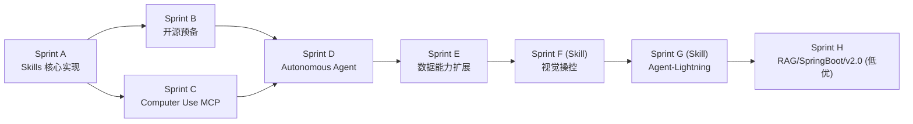
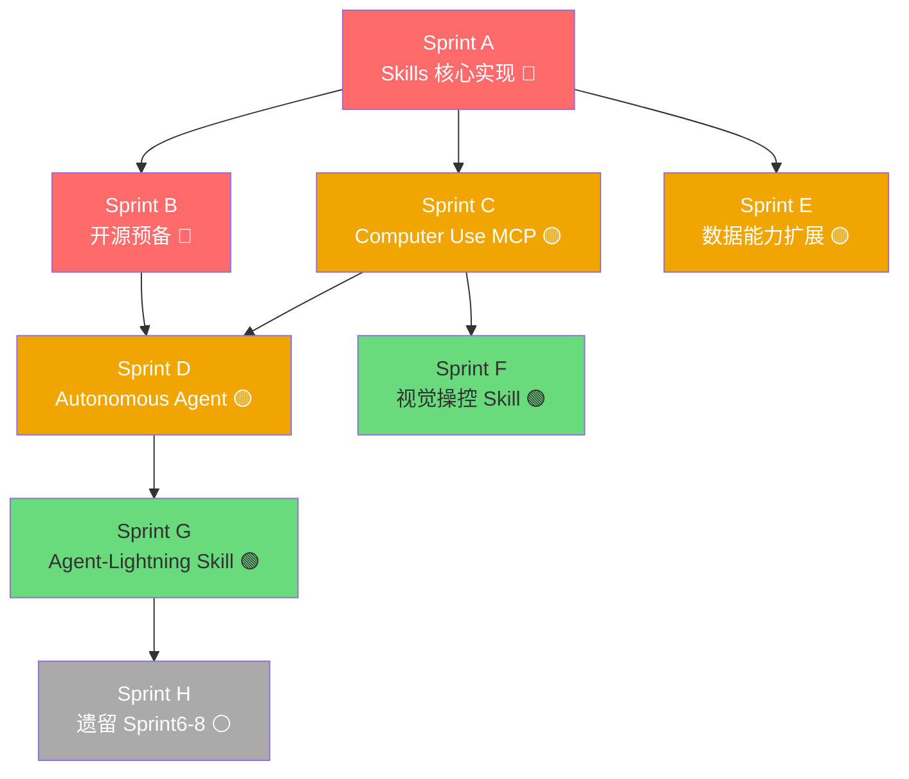

# AgentDSL 迭代开发计划 2.0

> **文档版本**：v2.0  
> **制定日期**：2026-03-04  
> **基于文档**：TODO_and_Backlog.md、agentSkills设计说明.md、agentdsl的skills功能设计实现_plan.md、AgentDSL 迭代开发计划.md、agent DSL需求演进文档.md、开源计划.md

---

## 总览与核心方向

本计划在原有 Sprint 1~5（已完成）基础上，综合以下新需求制定全新路线图：

| 优先级 | 新需求方向                                            | 来源                   |
| ------ | ----------------------------------------------------- | ---------------------- |
| 🔴 高   | **开源準备** - README、文档、CI/CD、许可证            | 开源计划.md            |
| 🔴 高   | **Skills 能力** - DSL 技能系统完整实现                | agentSkills设计说明.md |
| 🟡 中   | **Computer Use** - 对接 MCP Computer Use Server       | 需求 1                 |
| 🟡 中   | **Autonomous 自主 Agent** - 意图→规划→执行循环        | 需求 2                 |
| 🟡 中   | **数据能力扩展** - Excel/DB/图片/PDF 读写分析         | 需求 5                 |
| 🟢 低   | **视觉操控 (作为 Skill)** - Fara/Qwen2.5-VL 视觉模型  | 需求 3                 |
| 🟢 低   | **Agent-Lightning (作为 Skill)** - 高性能执行与自进化 | 需求 4                 |
| ⚪ 最低 | Sprint 6~8（原计划遗留）- RAG/Spring Boot/事件驱动    | 原计划                 |

---

## Roadmap 总览



| Sprint       | 主题                                            | 优先级 | 周期     | 依赖       |
| ------------ | ----------------------------------------------- | ------ | -------- | ---------- |
| **Sprint A** | Skills 核心实现（DSL + 运行时）                 | 🔴 高   | Week 1-2 | 无         |
| **Sprint B** | 开源预备（文档/CI/示例/README）                 | 🔴 高   | Week 2-3 | Sprint A   |
| **Sprint C** | Computer Use MCP 对接                           | 🟡 中   | Week 3-4 | Sprint A   |
| **Sprint D** | Autonomous 自主 Agent                           | 🟡 中   | Week 4-5 | Sprint B+C |
| **Sprint E** | 数据能力扩展（Excel/DB/图片/PDF）               | 🟡 中   | Week 5-6 | Sprint A   |
| **Sprint F** | 视觉操控 Skill（Fara/Qwen-VL）                  | 🟢 低   | Week 7-8 | Sprint C   |
| **Sprint G** | Agent-Lightning Skill                           | 🟢 低   | Week 8-9 | Sprint D   |
| **Sprint H** | 遗留原计划 Sprint6~8（RAG/SpringBoot/事件驱动） | ⚪ 最低 | Week 10+ | Sprint G   |

---

## Sprint A：Skills 核心实现（优先级：🔴 高）

**目标**：将 skills 功能从设计落地为完整实现，支持描述型和逻辑型两类技能。

> 参考：[agentdsl的skills功能设计实现_plan.md](file:///Users/wuguirong/sourceCode/AgentDSL/doc/agentdsl的skills功能设计实现_plan.md)

### 任务清单

| #    | 任务                                                                           | 模块                | 文件                                   | 工时 | 优先级 |
| ---- | ------------------------------------------------------------------------------ | ------------------- | -------------------------------------- | ---- | ------ |
| A.1  | 新增 `SkillSpec.java`（扁平 POJO，`type` 枚举区分 PROMPT/LOGIC）               | `agentdsl-core`     | `spec/SkillSpec.java` [NEW]            | 2h   | P0     |
| A.2  | 新增 `SkillDelegate.groovy`（处理 `skill("name") {...}` 块）                   | `agentdsl-core`     | `dsl/SkillDelegate.groovy` [NEW]       | 2h   | P0     |
| A.3  | 新增 `SkillsBlockDelegate.groovy`（处理 `skills { include "xxx" }` 块）        | `agentdsl-core`     | `dsl/SkillsBlockDelegate.groovy` [NEW] | 1h   | P0     |
| A.4  | 修改 `AgentSpec.java` 增加 `skillRefs` 字段                                    | `agentdsl-core`     | `spec/AgentSpec.java`                  | 0.5h | P0     |
| A.5  | 修改 `AgentDelegate.groovy` 增加 `skills { ... }` 关键字                       | `agentdsl-core`     | `dsl/AgentDelegate.groovy`             | 1h   | P0     |
| A.6  | 修改 `DslBaseScript.groovy` 增加顶层 `skill()` 关键字                          | `agentdsl-core`     | `dsl/DslBaseScript.groovy`             | 1h   | P0     |
| A.7  | 修改 `DslCompileResult.java` 增加 `skills` 字段                                | `agentdsl-compiler` | `DslCompileResult.java`                | 0.5h | P0     |
| A.8  | 修改 `DslValidator.java` 增加 `validateSkill()` 和 `validateSkillReferences()` | `agentdsl-compiler` | `DslValidator.java`                    | 2h   | P0     |
| A.9  | 修改 `DslCompiler.java` 收集 skills 并传入编译结果                             | `agentdsl-compiler` | `DslCompiler.java`                     | 1h   | P0     |
| A.10 | 修改 `AgentRegistry.java` 增加 `registerSkill()`，将 Skill 展平为 ToolSpec     | `agentdsl-runtime`  | `AgentRegistry.java`                   | 3h   | P0     |
| A.11 | 修改 `AgentDslEngine.java` 在加载流程中增加 Skill 注册步骤                     | `agentdsl-runtime`  | `AgentDslEngine.java`                  | 1h   | P0     |
| A.12 | 修改 `ListCommand.java` 增加 Skill 列表展示                                    | `agentdsl-cli`      | `ListCommand.java`                     | 0.5h | P1     |
| A.13 | 编写示例脚本 `examples/skill-demo.agent.groovy`                                | `examples`          | [NEW]                                  | 1h   | P1     |
| A.14 | 编写单元测试 `DslSkillTest.java`                                               | `agentdsl-compiler` | `test/DslSkillTest.java` [NEW]         | 2h   | P0     |

### DSL 语法设计

```groovy
// 描述型技能（Prompt Skill）
skill("competitive-analyst") {
    type "prompt"
    description "当用户需要分析某公司的竞争对手和市场趋势时，调用此技能"
    instruction '''你是一位资深市场分析师，请识别主要竞争对手并给出市场趋势判断。'''
    parameter {
        name "company"
        type "string"
        description "目标公司名称"
        required true
    }
}

// 逻辑型技能（Logic Skill）
skill("data-pipeline") {
    type "logic"
    description "当用户需要从多个数据源汇总并清洗数据时，调用此技能"
    execute { params ->
        def sources = params.sources.split(",")
        sources.collect { src -> toolCall("http_get", [url: src.trim()]) }.join("\n---\n")
    }
}

// Agent 挂载技能
agent("market-bot") {
    model { provider "ollama"; modelName "qwen3:4b" }
    skills {
        include "competitive-analyst"
        include "data-pipeline"
    }
}
```

### 验收标准

- [ ] `skill()` 定义可在 DSL 中正确解析为 `SkillSpec`
- [ ] Prompt 型 Skill：执行时注入 instruction 到 LLM 上下文
- [ ] Logic 型 Skill：执行时调用 Groovy 闭包
- [ ] Agent `use skills` 挂载后，Skill 在 LangChain4j 中注册为 ToolSpecification
- [ ] `DslValidator` 对无效技能引用（`include` 不存在的 skill）报错
- [ ] `agentdsl list` 命令显示已注册的技能列表
- [ ] 全量测试通过：`./gradlew test`

---

## Sprint B：开源预备（优先级：🔴 高）

**目标**：满足开源的"入场券"条件，让项目达到可以公开发布的工程标准。

> 参考：[开源计划.md](file:///Users/wuguirong/sourceCode/AgentDSL/doc/开源计划.md)

### 任务清单

| #    | 任务                                                             | 模块                | 工时 | 优先级 |
| ---- | ---------------------------------------------------------------- | ------------------- | ---- | ------ |
| B.1  | 编写完整 `README.md`（中英双语，含 5 分钟快速示例）              | 根目录              | 4h   | P0     |
| B.2  | 编善 DSL 语法手册（`agent/tool/workflow/skill` 全属性）          | `doc/`              | 4h   | P0     |
| B.3  | 编写架构说明书（模块说明 + SPI 扩展指南）                        | `doc/`              | 3h   | P1     |
| B.4  | 配置 GitHub Actions CI（build + test + 覆盖率）                  | `.github/`          | 2h   | P0     |
| B.5  | 添加 Apache 2.0 开源许可证                                       | 根目录              | 0.5h | P0     |
| B.6  | 完善 `.gitignore`、`CONTRIBUTING.md`、`CHANGELOG.md`             | 根目录              | 1h   | P1     |
| B.7  | 录制 Terminal 演示视频（CLI + MCP + Skills + Trace）             | -                   | 2h   | P1     |
| B.8  | 制作 Docker 一键运行镜像                                         | `docker/`           | 3h   | P2     |
| B.9  | 编写完整示例套件（数据库报表、MCP 多 Agent、技能对比）           | `examples/`         | 4h   | P0     |
| B.10 | 解决技术债：引入 WireMock 替换测试中的真实 LLM 调用              | 各模块              | 3h   | P0     |
| B.11 | `DslCompileResult Diagnostic` - 支持软性警告收集                 | `agentdsl-compiler` | 2h   | P1     |
| B.12 | CLI 集成测试覆盖（`RunCommand / ValidateCommand / ListCommand`） | `agentdsl-cli`      | 2h   | P1     |

### 开源路径规划

```
Stage 1 预热 → Stage 2 核心开源 → Stage 3 生态注入 → Stage 4 商业化探索
```

| 阶段                 | 关键动作                                       | 目标             |
| -------------------- | ---------------------------------------------- | ---------------- |
| **Stage 1 预热**     | 完善 README + 演示视频 + 获取第一批 Star       | 建立品牌认知     |
| **Stage 2 核心开源** | 开放 `core/compiler/runtime` 模块，发布 v1.0.0 | 确立 DSL 标准    |
| **Stage 3 生态注入** | 宣传 MCP + Skills，邀请贡献者                  | 建立社区护城河   |
| **Stage 4 商业化**   | 推出 SaaS 控制台和云端托管                     | 开源引流商业盈利 |

### 验收标准

- [ ] 新用户 5 分钟内可在本地跑通第一个 Agent
- [ ] GitHub Actions CI 全绿，测试通过率 100%
- [ ] 所有测试 `./gradlew test` 无真实 LLM 调用，30 秒内完成
- [ ] README 中有架构图、快速开始和功能特性说明
- [ ] Apache 2.0 许可证添加完成

---

## Sprint C：Computer Use MCP 对接（优先级：🟡 中）

**目标**：通过对接现成的 Computer Use MCP Server，以最低成本赋予 Agent 操作计算机的能力。

> **技术选型**：直接对接 MCP 生态已有的 Computer Use Server（如 `@modelcontextprotocol/server-playwright`、`computer-use-aci` 等），利用 AgentDSL 已有的 MCP Client 能力，**无需自己实现底层操作逻辑**。

### 背景分析

| 方案                                   | 实现成本                | 推荐度 |
| -------------------------------------- | ----------------------- | ------ |
| ✅ 对接 MCP Computer Use Server（推荐） | 低（复用已有 MCP 模块） | 🔴 推荐 |
| ❌ 自研 Playwright/Java Robot 集成      | 高（需实现桥接层）      | 不推荐 |

直接复用 `agentdsl-mcp` 已有能力，通过 DSL 声明即可连接 Computer Use 类型的 MCP Server。

### 任务清单

| #   | 任务                                                                   | 模块               | 文件                                   | 工时 | 优先级 |
| --- | ---------------------------------------------------------------------- | ------------------ | -------------------------------------- | ---- | ------ |
| C.1 | 调研并测试可用的 Computer Use MCP Server（Playwright/screen-computer） | -                  | 调研文档                               | 3h   | P0     |
| C.2 | 新增 DSL 语法糖：`computer_use { }` 块（本质是 MCP preset）            | `agentdsl-core`    | `dsl/ComputerUseDelegate.groovy` [NEW] | 2h   | P0     |
| C.3 | 新增 `ComputerUseSpec` 模型（预设 MCP server + 安全配置）              | `agentdsl-core`    | `spec/ComputerUseSpec.java` [NEW]      | 1h   | P0     |
| C.4 | `AgentDelegate` 增加 `computer_use {}` 关键字                          | `agentdsl-core`    | `dsl/AgentDelegate.groovy`             | 0.5h | P0     |
| C.5 | 在 `McpToolProviderBridge` 中增加对 Computer Use 类 Server 的安全过滤  | `agentdsl-mcp`     | `McpToolProviderBridge.java`           | 2h   | P1     |
| C.6 | 安全约束：HITL（人机协同）支持 - 危险操作触发用户确认                  | `agentdsl-runtime` | `SafetyGuard.java` [NEW]               | 3h   | P1     |
| C.7 | 编写示例脚本 `examples/computer-use.agent.groovy`                      | `examples`         | [NEW]                                  | 1h   | P1     |
| C.8 | 集成测试：验证 Agent 可通过 MCP 操作浏览器                             | `agentdsl-mcp`     | `test/ComputerUseTest.java` [NEW]      | 2h   | P0     |

### DSL 语法设计

```groovy
// 方案一：直接用已有的 mcp {} 语法（零成本接入）
agent("web-operator") {
    model { provider "ollama"; modelName "qwen3:4b" }
    mcp {
        server("playwright") {
            transport "stdio"
            command "npx", "-y", "@playwright/mcp"
        }
        // 安全过滤：只允许特定操作
        filterTools "browser_navigate", "browser_click", "browser_type", "browser_screenshot"
    }
}

// 方案二：新增语法糖（更语义化）
agent("web-operator") {
    model { provider "ollama"; modelName "qwen3:4b" }
    computer_use {
        browser "playwright"       // 使用 Playwright MCP Server
        sandbox true               // 开启视觉沙箱
        hitl_on "delete", "submit" // 这些动作需要用户确认
        max_actions 20             // 防止死循环
    }
}
```

### 验收标准

- [ ] Agent 可通过 DSL 声明连接 Playwright MCP Server
- [ ] Agent 可执行简单的浏览器操作（导航、点击、截图）
- [ ] 危险操作（如表单提交）触发 HITL 确认机制
- [ ] 安全过滤：工具白名单生效
- [ ] 全量测试通过

---

## Sprint D：Autonomous 自主 Agent（优先级：🟡 中）

**目标**：实现"意图 → 规划 → 执行 → 观察 → 修正"的 ReAct 自主循环，让用户描述需求后 Agent 自主完成任务。

> 参考：[agent DSL需求演进文档.md](file:///Users/wuguirong/sourceCode/AgentDSL/doc/agent%20DSL需求演进文档.md) §2.2

### 任务清单

| #   | 任务                                                                       | 模块               | 文件                                     | 工时 | 优先级 |
| --- | -------------------------------------------------------------------------- | ------------------ | ---------------------------------------- | ---- | ------ |
| D.1 | 新增 `AutonomousSpec` 模型（mode、max_steps、capabilities）                | `agentdsl-core`    | `spec/AutonomousSpec.java` [NEW]         | 1h   | P0     |
| D.2 | 修改 `AgentSpec` 增加 `autonomous` 字段和 `mode` 枚举                      | `agentdsl-core`    | `spec/AgentSpec.java`                    | 0.5h | P0     |
| D.3 | `AgentDelegate` 增加 `mode AUTONOMOUS`、`max_steps`、`capabilities` 关键字 | `agentdsl-core`    | `dsl/AgentDelegate.groovy`               | 2h   | P0     |
| D.4 | 新增 `PlannerEngine`（基于 LangChain4j AiServices 实现 ReAct 规划器）      | `agentdsl-runtime` | `planner/PlannerEngine.java` [NEW]       | 5h   | P0     |
| D.5 | 新增 `AutonomousExecutor`（驱动 ReAct 循环：Plan→Act→Observe→Reflect）     | `agentdsl-runtime` | `executor/AutonomousExecutor.java` [NEW] | 5h   | P0     |
| D.6 | 修改 `AgentExecutor` 支持按 `mode` 路由到 `AutonomousExecutor`             | `agentdsl-runtime` | `AgentExecutor.java`                     | 2h   | P0     |
| D.7 | Token 熔断机制（单次任务超过最大 steps/token 强制挂起）                    | `agentdsl-runtime` | `AutonomousExecutor.java`                | 2h   | P1     |
| D.8 | 编写示例脚本 `examples/autonomous-agent.agent.groovy`                      | `examples`         | [NEW]                                    | 1h   | P1     |
| D.9 | 集成测试：自主 Agent 完成多步任务场景                                      | `agentdsl-runtime` | `test/AutonomousExecutorTest.java` [NEW] | 3h   | P0     |

### DSL 语法设计

agent("AutoAssistant") {
    model { provider "ollama"; modelName "qwen3:14b" }
    
    autonomous {
        execution_mode "plan"  // "plan" | "fast"
        max_steps 10           // 默认 10，超过后询问用户
    }
    
    tools {
        include "web_search"
        include "file_write"
    }
    
    systemPrompt "你是一个自主任务助手，帮助用户完成复杂的多步骤任务。"
}
```

### ReAct 执行循环

```
用户意图 → Planner (生成当前步骤) → Act (执行 Tool/Skill) → Observe (获取结果) → Reflect (判断是否完成/修正计划) → [循环或结束]
```

### 验收标准

- [x] DSL 中可通过 `autonomous { ... }` 开启自主模式
- [x] 支持 `plan`（确认后执行）与 `fast`（直接执行）两种模式
- [x] Agent 接受描述目标后，能由 `PlannerEngine` 自主规划多步执行计划
- [x] 超过 `max_steps` 后自动暂停并交互式询问用户是否继续
- [x] 通过 `UserInteraction` 接口解耦用户反馈（CLI/Web 兼容）
- [x] 执行过程生成完整 `AutonomousResult` 与步骤详情
- [x] 单元测试 `AutonomousDslTest` 解析与校验全量通过
- [x] 全量项目测试通过 (BUILD SUCCESSFUL)

---

## Sprint E：数据能力扩展（优先级：🟡 中）

**目标**：集成 Excel 读写、数据库操作、图片内容识别、PDF 内容识别，作为内置工具扩展 `agentdsl-tools`。

### 任务清单

| #   | 任务                                                                               | 模块             | 文件                                        | 工时 | 优先级 |
| --- | ---------------------------------------------------------------------------------- | ---------------- | ------------------------------------------- | ---- | ------ |
| E.1 | **Excel 工具**：实现 `ExcelTool`（读取/写入 .xlsx，基于 Apache POI）               | `agentdsl-tools` | `tools/builtin/ExcelTool.java` [NEW]        | 4h   | P0     |
| E.2 | **数据库工具**：实现 `DatabaseTool`（SQL 查询/写入，支持 MySQL/PostgreSQL/SQLite） | `agentdsl-tools` | `tools/builtin/DatabaseTool.java` [NEW]     | 5h   | P0     |
| E.3 | **PDF 识别工具**：实现 `PdfTool`（提取文本/表格，基于 Apache PDFBox）              | `agentdsl-tools` | `tools/builtin/PdfTool.java` [NEW]          | 3h   | P0     |
| E.4 | **图片识别工具**：实现 `ImageTool`（调用多模态 LLM API 识别图片内容）              | `agentdsl-tools` | `tools/builtin/ImageTool.java` [NEW]        | 3h   | P0     |
| E.5 | 将 E.1~E.4 注册到 `BuiltinToolRegistry`                                            | `agentdsl-tools` | `BuiltinToolRegistry.java`                  | 1h   | P0     |
| E.6 | 数据库连接池配置（`DatabaseSpec` + `DataSourceFactory`）                           | `agentdsl-core`  | `spec/DatabaseSpec.java` [NEW]              | 2h   | P1     |
| E.7 | DSL 语法支持数据库连接声明 `datasource { ... }`                                    | `agentdsl-core`  | `dsl/DataSourceDelegate.groovy` [NEW]       | 2h   | P1     |
| E.8 | 编写示例脚本（数据库报表生成 + Excel 输出）                                        | `examples`       | `examples/data-analysis.agent.groovy` [NEW] | 1h   | P1     |
| E.9 | 单元测试：各工具基础功能                                                           | `agentdsl-tools` | `test/`                                     | 4h   | P0     |

### Excel 工具接口设计

```java
@AgentTool(name = "excel_read", description = "读取 Excel 文件内容，返回 JSON 格式的表格数据")
public String excelRead(
    @ToolParam(description = "Excel 文件路径") String filePath,
    @ToolParam(description = "Sheet 名称，默认第一个", required = false) String sheetName
) { ... }

@AgentTool(name = "excel_write", description = "将数据写入 Excel 文件")
public String excelWrite(
    @ToolParam(description = "目标文件路径") String filePath,
    @ToolParam(description = "JSON 格式的表格数据") String jsonData,
    @ToolParam(description = "Sheet 名称", required = false) String sheetName
) { ... }
```

### 数据库工具接口设计

```java
@AgentTool(name = "db_query", description = "执行 SQL 查询并返回 JSON 格式结果")
public String dbQuery(
    @ToolParam(description = "数据源名称（在 DSL datasource 中声明）") String datasource,
    @ToolParam(description = "SQL 查询语句（只允许 SELECT）") String sql
) { ... }

@AgentTool(name = "db_execute", description = "执行 SQL 写操作（INSERT/UPDATE/DELETE）")
public String dbExecute(
    @ToolParam(description = "数据源名称") String datasource,
    @ToolParam(description = "SQL 语句") String sql
) { ... }
```

### DSL 数据库声明语法

```groovy
datasource("my-db") {
    type "mysql"
    url "jdbc:mysql://localhost:3306/mydb"
    username env("DB_USER")
    password env("DB_PASS")
    maxConnections 5
}

agent("data-analyst") {
    model { provider "ollama"; modelName "qwen3:4b" }
    tools { include "db_query", "excel_write", "pdf_read" }
    datasources { use "my-db" }
}
```

### 验收标准

- [ ] `ExcelTool` 可读取 `.xlsx` 文件并返回 JSON 格式数据
- [ ] `ExcelTool` 可将 JSON 数据写入 Excel 文件
- [ ] `DatabaseTool` 支持 MySQL/PostgreSQL 的查询和写操作
- [ ] `PdfTool` 可从 PDF 中提取文字内容
- [ ] `ImageTool` 可调用多模态 LLM 识别图片内容（需配置支持视觉的模型）
- [ ] DSL 中声明 `datasource {}` 后，Agent 可通过工具名引用
- [ ] 所有工具注册到 `BuiltinToolRegistry`，可通过 `agentdsl list` 查看
- [ ] 全量测试通过

---

## Sprint F：视觉操控 Skill（优先级：🟢 低）

**目标**：将视觉操控能力（Fara/Qwen2.5-VL）实现为一个轻量级 **Skill 模板**，而非独立模块，降低集成复杂度。

> **实现策略**：作为一个 `LogicSkillSpec`，在 DSL 中以 Skill 形式编写，调用本地或远程视觉模型 API 实现截图识别 + 坐标操控。

### 任务清单

| #   | 任务                                                                     | 模块              | 文件                                         | 工时 | 优先级 |
| --- | ------------------------------------------------------------------------ | ----------------- | -------------------------------------------- | ---- | ------ |
| F.1 | 调研 Fara/Qwen2.5-VL-7B 的本地部署 API 接口                              | -                 | 调研文档                                     | 3h   | P0     |
| F.2 | 新增 `ScreenCaptureTool`（截图工具，返回 Base64 图片）                   | `agentdsl-tools`  | `tools/builtin/ScreenCaptureTool.java` [NEW] | 2h   | P0     |
| F.3 | 新增 `VisionModelTool`（调用视觉模型，输入截图+指令，返回操作坐标/描述） | `agentdsl-tools`  | `tools/builtin/VisionModelTool.java` [NEW]   | 4h   | P0     |
| F.4 | 新增 `MouseKeyboardTool`（模拟鼠标点击/键盘输入，基于 Java Robot）       | `agentdsl-tools`  | `tools/builtin/MouseKeyboardTool.java` [NEW] | 3h   | P1     |
| F.5 | 编写 Vision Skill 模板（`skills/vision-control.skill.groovy`）           | `examples/skills` | [NEW]                                        | 2h   | P0     |
| F.6 | 更新文档：视觉 Skill 集成指南                                            | `doc/`            | `doc/vision-skill-guide.md` [NEW]            | 2h   | P1     |

### Vision Skill 模板设计

```groovy
// skills/vision-control.skill.groovy
// 直接作为 Logic Skill 定义，对接本地 Qwen2.5-VL 服务

skill("vision-click") {
    type "logic"
    description "当需要点击屏幕上某个可见元素时调用此技能，通过视觉模型识别位置"
    
    parameter {
        name "target_description"
        type "string"
        description "要点击的元素的文字描述（如：'提交按钮'、'搜索框'）"
        required true
    }
    
    execute { params ->
        // 1. 截图
        def screenshot = toolCall("screen_capture", [:])
        // 2. 调用视觉模型识别坐标（对接 Qwen2.5-VL 或 Fara）
        def result = toolCall("vision_model_locate", [
            image: screenshot,
            instruction: "请找到 '${params.target_description}' 的中心坐标，返回 JSON {x: number, y: number}"
        ])
        // 3. 执行点击
        def coords = parseJson(result)
        toolCall("mouse_click", [x: coords.x, y: coords.y])
    }
}
```

### 验收标准

- [ ] `ScreenCaptureTool` 可截取当前屏幕并返回 Base64
- [ ] `VisionModelTool` 可连接本地视觉模型（Ollama 或 HTTP API）
- [ ] Vision Skill 模板可加载、解析、执行
- [ ] 执行视觉点击操作后，坐标正确识别
- [ ] 文档说明如何配置视觉模型

---

## Sprint G：Agent-Lightning Skill（优先级：🟢 低）

**目标**：将 Agent-Lightning 的高性能执行与 Prompt 自优化能力，以轻量级 **Skill + 扩展配置**形式集成。

> **实现策略**：不引入完整的 Lightning 框架，而是借鉴其核心思想：
> 1. **异步事件引擎**：升级 `WorkflowExecutor` 使用 Java 虚拟线程（Project Loom）
> 2. **Trace 反馈闭环**：利用已有 `ExecutionTrace` + LLM 分析失败轨迹，自动生成优化建议

### 任务清单

| #   | 任务                                                                        | 模块               | 文件                                        | 工时 | 优先级 |
| --- | --------------------------------------------------------------------------- | ------------------ | ------------------------------------------- | ---- | ------ |
| G.1 | `WorkflowExecutor` 升级为虚拟线程（Project Loom）池                         | `agentdsl-runtime` | `WorkflowExecutor.java`                     | 3h   | P0     |
| G.2 | 新增 `TraceAnalyzer`（分析失败 Trace，调用 LLM 生成优化建议）               | `agentdsl-runtime` | `optimizer/TraceAnalyzer.java` [NEW]        | 4h   | P0     |
| G.3 | 新增 `PromptOptimizer`（根据 TraceAnalyzer 结果自动更新 SystemPrompt 建议） | `agentdsl-runtime` | `optimizer/PromptOptimizer.java` [NEW]      | 3h   | P1     |
| G.4 | DSL 支持 `auto_optimize true` 配置开启自优化                                | `agentdsl-core`    | `dsl/AgentDelegate.groovy`                  | 1h   | P1     |
| G.5 | 编写 Optimizer Skill 模板（封装 TraceAnalyzer 为可调用技能）                | `examples/skills`  | `skills/trace-optimizer.skill.groovy` [NEW] | 2h   | P2     |
| G.6 | 性能基准测试：对比虚拟线程前后的并发吞吐量                                  | `agentdsl-runtime` | `test/BenchmarkTest.java` [NEW]             | 2h   | P1     |

### 验收标准

- [ ] `WorkflowExecutor` 使用虚拟线程，并发性能提升 ≥ 20%（基准测试验证）
- [ ] `TraceAnalyzer` 可读取失败 ExecutionTrace 并生成优化建议
- [ ] Agent 配置 `auto_optimize true` 后，失败任务自动记录并分析
- [ ] 全量测试通过

---

## Sprint H：遗留原计划实现（优先级：⚪ 最低）

**目标**：完成原迭代计划 Sprint 6~8 的遗留功能，排在所有新需求之后。

> 参考：[AgentDSL 迭代开发计划.md](file:///Users/wuguirong/sourceCode/AgentDSL/doc/AgentDSL%20迭代开发计划.md) Sprint 6~8

### H-1：Sprint 6 遗留 - RAG 系统增强（2 周）

| #    | 任务                                                    | 工时 |
| ---- | ------------------------------------------------------- | ---- |
| H1.1 | `EmbeddingModelFactory` 多 Provider 支持                | 3h   |
| H1.2 | `EmbeddingStoreFactory` 外部存储支持（Chroma/Pinecone） | 4h   |
| H1.3 | `ContentRetrieverSpec` 扩展字段 + `RagDelegate` 适配    | 4h   |
| H1.4 | `DocumentSpec` + 文档加载器（PDF/Markdown/HTML）        | 6h   |
| H1.5 | `LangChainRagFactory` 重构 + 集成测试                   | 6h   |

### H-2：Sprint 7 遗留 - Spring Boot Starter

| #    | 任务                                               | 工时 |
| ---- | -------------------------------------------------- | ---- |
| H2.1 | 新建 `agentdsl-spring-boot-starter` 模块           | 1h   |
| H2.2 | `AgentDslAutoConfiguration` + `AgentDslProperties` | 5h   |
| H2.3 | `@EnableAgentDsl` 注解 + REST Controller 自动注册  | 4h   |
| H2.4 | Agent 目录扫描热加载 + 集成测试                    | 4h   |

### H-3：Sprint 8~10 遗留 - v2.0 事件驱动多 Agent

| #    | 任务                                             | 工时 |
| ---- | ------------------------------------------------ | ---- |
| H3.1 | 事件驱动架构设计文档                             | 4h   |
| H3.2 | `EventSpec / SubscriptionSpec` + `EventBus` 接口 | 6h   |
| H3.3 | `InMemoryEventBus` + `subscribe/emit` DSL 关键字 | 8h   |
| H3.4 | Agent 事件处理器绑定 + 共享记忆上下文            | 8h   |
| H3.5 | v2.0 端到端集成测试 + 语言规范更新               | 6h   |

---

## 技术债务穿插清理

以下债务在对应阶段同步清理（参考 TODO_and_Backlog.md）：

| 债务项                                               | 安排 Sprint | 优先级 |
| ---------------------------------------------------- | ----------- | ------ |
| `StepTrace` 补全（parallel/condition/loop 分支节点） | Sprint A    | 🔴      |
| WireMock 替换测试中真实 LLM 调用                     | Sprint B    | 🔴      |
| `DslCompileResult Diagnostic` 软性警告               | Sprint B    | 🟡      |
| CLI 集成测试覆盖                                     | Sprint B    | 🟡      |
| MDC 字段扩展（结构化日志）                           | Sprint D    | 🟡      |
| 热加载只加载变更文件优化                             | Sprint G    | 🟢      |
| Micrometer/OpenTelemetry 指标导出                    | Sprint H    | ⚪      |

---

## 依赖关系图



---

## 资源估算总览

| Sprint   | 主题                  | 估算工时 | 建议周期 |
| -------- | --------------------- | -------- | -------- |
| Sprint A | Skills 核心实现       | ~20h     | Week 1-2 |
| Sprint B | 开源预备              | ~28h     | Week 2-3 |
| Sprint C | Computer Use MCP      | ~15h     | Week 3-4 |
| Sprint D | Autonomous Agent      | ~22h     | Week 4-5 |
| Sprint E | 数据能力扩展          | ~22h     | Week 5-6 |
| Sprint F | 视觉操控 Skill        | ~16h     | Week 7-8 |
| Sprint G | Agent-Lightning Skill | ~15h     | Week 8-9 |
| Sprint H | 遗留 Sprint6~8        | ~56h     | Week 10+ |

---

## 风险与注意事项

| 风险项                                 | 影响                  | 缓解措施                              |
| -------------------------------------- | --------------------- | ------------------------------------- |
| Computer Use MCP Server 成熟度参差不齐 | C Sprint 延期         | 优先选择官方背书的 `@playwright/mcp`  |
| 自主 Agent 无限循环                    | 系统资源耗尽          | `max_steps` 强制熔断 + Token 预算控制 |
| 视觉模型本地部署硬件要求               | F Sprint 依赖用户环境 | 支持远程 API 模式，不强求本地部署     |
| 开源后沙箱安全漏洞曝光                 | 信任危机              | Sprint B 前完成 Groovy 沙箱安全审查   |
| 数据库工具 SQL 注入风险                | 安全漏洞              | 只支持参数化查询，拒绝动态拼接 SQL    |
