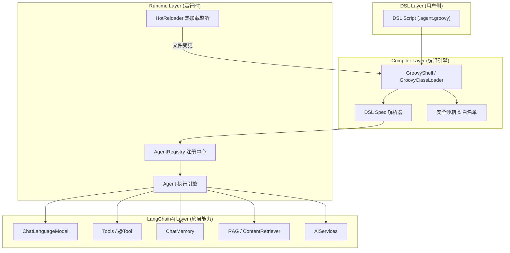
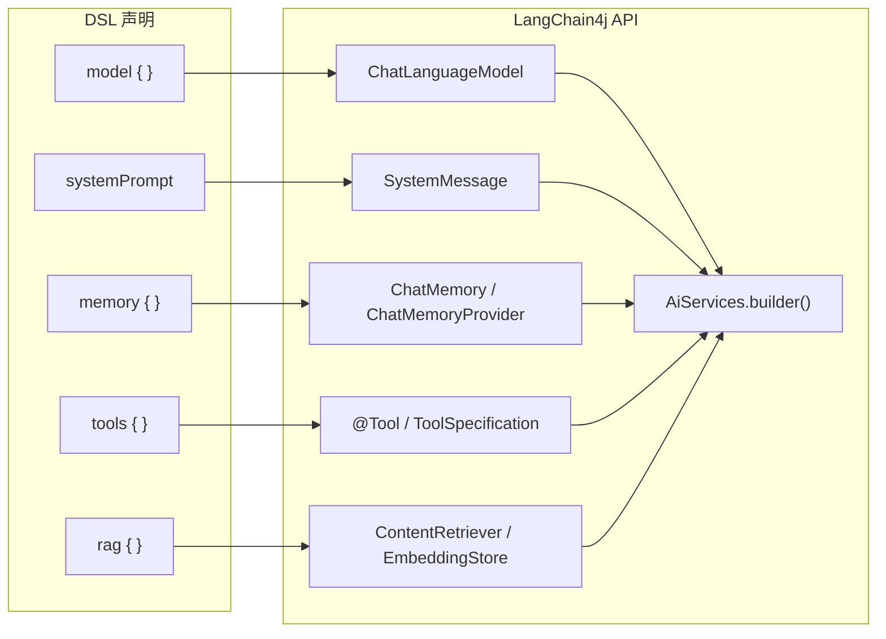
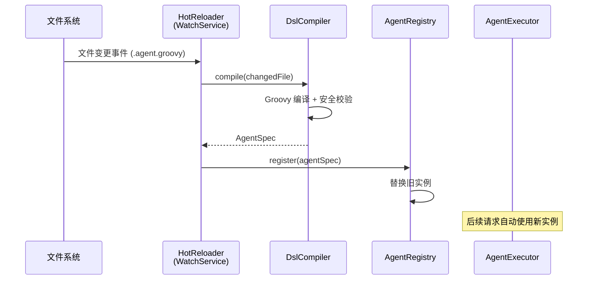

# AgentDSL — 基于 LangChain4j + Groovy 的 Agent 构建 DSL 引擎

## 项目目标

基于 **Groovy DSL** 和 **LangChain4j** 构建一套运行于 JVM 的 Agent 编排引擎。

> [!NOTE]
> 语法规范详见 [AgentDSL-Language-Spec-v1.0.md](file:///Users/wuguirong/sourceCode/AgentDSL/doc/AgentDSL-Language-Spec-v1.0.md)

核心能力：

1. **声明式 DSL 定义 Agent** — 用 Groovy 闭包风格描述 Agent 的模型、工具、记忆、提示词
2. **热加载 & 动态构建** — DSL 脚本可从文件/数据库/Git 加载，通过 `GroovyShell` 动态编译执行，无需重启
3. **映射到 LangChain4j** — DSL 编译后生成的 Groovy 代码直接调用 LangChain4j API，享受成熟生态

---

## 整体架构



> [!IMPORTANT]
> 核心设计原则：**DSL 不发明新的 AI 能力，而是用声明式语法简化 LangChain4j 的使用**。所有底层能力由 LangChain4j 提供，DSL 只做编排与简化。

---

## DSL 语法设计

采用 **Gradle 风格的闭包嵌套** 语法，这是 Groovy DSL 最成熟的范式，Java 开发者学习成本最低。

### 基础 Agent 定义

```groovy
// my-assistant.agent.groovy
agent("customer-support") {

    description "客户支持助手"

    model {
        provider "openai"            // 或 "ollama", "dashscope" 等
        modelName "gpt-4"
        temperature 0.7
        maxTokens 2000
    }

    systemPrompt """
        你是一个专业的客户支持助手。
        请用简洁、友好的方式回答客户的问题。
    """

    memory {
        type "message_window"        // 消息窗口记忆
        maxMessages 20
    }

    tools {
        include "orderQuery"         // 引用已注册的工具
        include "productSearch"

        // 内联定义工具
        tool("getCurrentTime") {
            description "获取当前时间"
            execute { ->
                return java.time.LocalDateTime.now().toString()
            }
        }
    }

    rag {
        contentRetriever {
            type "embedding_store"
            embeddingModel "text-embedding-3-small"
            maxResults 5
            minScore 0.7
        }
    }

    guardrails {
        maxTokensPerRequest 4000
        blockedTopics "politics", "violence"
    }
}
```

### 多 Agent 工作流

```groovy
// support-workflow.agent.groovy
workflow("ticket-resolution") {

    description "工单解决流程"

    // 定义参与的 agents
    agents {
        ref "classifier"             // 引用已注册的 agent
        ref "customer-support"
        ref "escalation-handler"
    }

    // 定义流程
    flow {
        start("classifier") {
            onResult { result ->
                when(result.category) {
                    "simple"   -> route("customer-support")
                    "complex"  -> route("escalation-handler")
                    default    -> route("customer-support")
                }
            }
        }

        node("customer-support") {
            onComplete { -> done() }
        }

        node("escalation-handler") {
            onComplete { -> done() }
        }
    }
}
```

---

## 模块划分

项目采用 **Gradle 多模块** 结构（Maven 亦可）：

| 模块                           | 职责                              | 关键类                                                                   |
| ------------------------------ | --------------------------------- | ------------------------------------------------------------------------ |
| `agentdsl-core`                | DSL 语法核心：Spec 模型 + Builder | `AgentSpec`, `ModelSpec`, `ToolSpec`, `MemorySpec`, `WorkflowSpec`       |
| `agentdsl-compiler`            | Groovy 编译引擎 + 安全沙箱        | `DslCompiler`, `DslClassLoader`, `SecurityManager`                       |
| `agentdsl-runtime`             | Agent 注册/执行/热加载            | `AgentRegistry`, `AgentExecutor`, `HotReloader`                          |
| `agentdsl-langchain4j`         | LangChain4j 适配层                | `LangChainModelFactory`, `LangChainToolBridge`, `LangChainMemoryFactory` |
| `agentdsl-tools`               | 内置通用工具集                    | `HttpTool`, `DatabaseTool`, `FileTool`                                   |
| `agentdsl-spring-boot-starter` | Spring Boot 集成（可选）          | `AgentDslAutoConfiguration`, `AgentDslProperties`                        |

---

## 核心类设计

### AgentSpec — DSL 解析后的中间模型

```java
public class AgentSpec {
    private String name;
    private String description;
    private ModelSpec model;
    private String systemPrompt;
    private MemorySpec memory;
    private List<ToolSpec> tools;
    private RagSpec rag;
    private GuardrailSpec guardrails;
    // getters, builders...
}
```

### DslCompiler — 编译入口

```java
public class DslCompiler {
    private final GroovyShell shell;
    private final CompilerConfiguration config;

    /**
     * 从脚本内容编译出 AgentSpec
     */
    public AgentSpec compile(String scriptContent) { ... }

    /**
     * 从文件路径编译
     */
    public AgentSpec compileFile(Path scriptPath) { ... }

    /**
     * 热编译 — 文件变更时重新编译并更新注册中心
     */
    public void hotReload(Path scriptPath) { ... }
}
```

### AgentRegistry — 注册中心

```java
public class AgentRegistry {
    private final ConcurrentHashMap<String, AgentInstance> agents;

    /** 注册 / 更新 agent */
    public void register(AgentSpec spec) { ... }

    /** 获取 agent 实例 */
    public AgentInstance get(String name) { ... }

    /** 执行 agent */
    public String chat(String agentName, String userMessage) { ... }
}
```

### LangChainModelFactory — 模型工厂

```java
public class LangChainModelFactory {
    /**
     * 根据 ModelSpec 创建 LangChain4j 的 ChatLanguageModel
     */
    public ChatLanguageModel create(ModelSpec spec) {
        return switch (spec.getProvider()) {
            case "openai" -> OpenAiChatModel.builder()
                .apiKey(spec.getApiKey())
                .modelName(spec.getModelName())
                .temperature(spec.getTemperature())
                .build();
            case "ollama" -> OllamaChatModel.builder()
                .baseUrl(spec.getBaseUrl())
                .modelName(spec.getModelName())
                .build();
            // ... 更多 provider
        };
    }
}
```

---

## DSL 脚本到 LangChain4j 的映射关系



---

## 热加载机制



---

## 安全沙箱设计

> [!CAUTION]
> DSL 脚本由外部用户编写，必须限制其能力，防止恶意代码执行。

| 安全措施       | 实现方式                                                                    |
| -------------- | --------------------------------------------------------------------------- |
| **类白名单**   | Groovy `CompilerConfiguration` + `ImportCustomizer`，仅允许导入白名单中的类 |
| **API 黑名单** | 禁止 `System.exit()`, `Runtime.exec()`, `ProcessBuilder` 等危险调用         |
| **资源限制**   | 脚本执行超时控制（如 30s），内存使用限制                                    |
| **网络隔离**   | 默认禁止 DSL 中发起网络请求，需通过 Tool 显式声明                           |
| **AST 检查**   | 通过 Groovy AST Transformation 在编译期检查并拦截违规代码                   |

---

## 分阶段实施路线图

### 第零阶段：DSL 语言规范定义（已完成）

- [x] 定义 DSL 关键字与语法结构 (EBNF)
- [x] 定义语义规则、必填校验、错误代码
- [x] 定义 Provider 注册表与 LangChain4j 映射表
- [x] 规划版本演进策略

### 第一阶段：基础骨架（2 周）

- [x] 初始化 Gradle 多模块项目结构
- [x] 实现 `agentdsl-core`：`AgentSpec` / `ModelSpec` / `ToolSpec` 等数据模型
- [x] 实现 `agentdsl-compiler`：基于 `GroovyShell` 的 DSL 编译器
- [x] 实现基础 DSL 语法的 `DslBaseScript` (Groovy 委托脚本基类)
- [x] 编写单元测试：验证 DSL 脚本可正确解析为 `AgentSpec`

### 第二阶段：LangChain4j 集成（2 周）

- [x] 实现 `agentdsl-langchain4j`：`ModelFactory` / `MemoryFactory` / `ToolBridge`
- [x] 实现 `AgentRegistry` 和 `AgentExecutor`
- [x] 打通端到端流程：DSL → 编译 → 注册 → 调用 LangChain4j → 返回结果
- [x] 支持 OpenAI / Ollama / DeepSeek 等至少 2 个模型 Provider
- [x] 编写集成测试：验证 DSL 定义的 Agent 可正常对话

### 第三阶段：热加载 & 工具系统（2 周）

- [x] 实现 `HotReloader`：基于 `WatchService` 监听 `.agent.groovy` 文件变更
- [x] 实现工具自动发现：扫描 `@AgentTool` 注解的 Bean
- [x] 实现 DSL 内联工具定义
- [x] 实现安全沙箱：`ImportCustomizer` + AST 校验
- [x] 编写安全测试：验证恶意脚本被拦截

### 第四阶段：工作流 & 多 Agent 协作（3 周）

- [ ] 实现 `WorkflowSpec` 和工作流 DSL 语法
- [ ] 实现工作流执行引擎：顺序 / 并行 / 条件路由
- [ ] 实现多 Agent 间的消息传递
- [ ] 接入 RAG 能力
- [ ] 端到端验证：多 Agent 工作流场景跑通

> [!IMPORTANT]
> 多 Agent 协作计划采用**事件驱动**的协同机制（`event` / `subscribe` 关键字），
> 此部分需要独立的设计文档详细规划，预计在 DSL v2.0 中引入。

---

## 项目结构

```
AgentDSL/
├── build.gradle                          # 根项目构建配置
├── settings.gradle                       # 多模块声明
├── doc/                                  # 已有文档
│
├── agentdsl-core/                        # 核心模型
│   └── src/main/java/
│       └── com/agentdsl/core/
│           ├── spec/                     # AgentSpec, ModelSpec, ToolSpec...
│           └── dsl/                      # DslBaseScript, 闭包委托
│
├── agentdsl-compiler/                    # 编译引擎
│   └── src/main/java/
│       └── com/agentdsl/compiler/
│           ├── DslCompiler.java
│           ├── DslClassLoader.java
│           └── sandbox/                  # 安全沙箱
│
├── agentdsl-runtime/                     # 运行时
│   └── src/main/java/
│       └── com/agentdsl/runtime/
│           ├── AgentRegistry.java
│           ├── AgentExecutor.java
│           ├── AgentInstance.java
│           └── HotReloader.java
│
├── agentdsl-langchain4j/                 # LangChain4j 适配
│   └── src/main/java/
│       └── com/agentdsl/langchain4j/
│           ├── LangChainModelFactory.java
│           ├── LangChainMemoryFactory.java
│           └── LangChainToolBridge.java
│
├── agentdsl-tools/                       # 内置工具
│   └── src/main/java/
│       └── com/agentdsl/tools/
│
├── agentdsl-spring-boot-starter/         # Spring Boot 集成 (可选)
│
└── examples/                             # DSL 脚本示例
    ├── simple-chat.agent.groovy
    ├── tool-agent.agent.groovy
    └── multi-agent-workflow.agent.groovy
```

---

## 技术栈

| 类别     | 技术选型                                   | 版本建议           |
| -------- | ------------------------------------------ | ------------------ |
| 语言     | Java 17+ / Groovy 4.x                      | JDK 17 LTS         |
| AI 框架  | LangChain4j                                | 1.0.x (最新稳定版) |
| 构建工具 | Gradle (Kotlin DSL)                        | 8.x                |
| DSL 引擎 | Groovy GroovyShell + CompilerConfiguration | 4.0.x              |
| 依赖注入 | Spring Boot（可选）                        | 3.x                |
| 测试     | JUnit 5 + Spock (Groovy 测试)              | —                  |
| 文件监听 | Java NIO WatchService                      | JDK 内置           |
| 日志     | SLF4J + Logback                            | —                  |

> Spring Boot 集成作为后续阶段的可选模块，初期保持纯 Java 实现。

---

## 验证方案

### 自动化测试

```bash
# 第一阶段验证：DSL 编译测试
./gradlew :agentdsl-core:test :agentdsl-compiler:test

# 第二阶段验证：LangChain4j 集成测试
./gradlew :agentdsl-langchain4j:test :agentdsl-runtime:test

# 全量测试
./gradlew test
```

- **单元测试**：验证 DSL 语法解析、Spec 模型构建、安全沙箱拦截
- **集成测试**：验证 DSL → LangChain4j 端到端调用（可用 Mock 模型）

### 手动验证

1. 编写一个简单的 `examples/simple-chat.agent.groovy`
2. 通过 CLI 或测试用例加载该脚本
3. 发送消息并验证 Agent 返回正确响应
4. 修改 DSL 脚本，验证热加载后 Agent 行为立即更新

---

## 已确认的设计决策

| 决策项        | 结论                                                                                                 |
| ------------- | ---------------------------------------------------------------------------------------------------- |
| 构建工具      | Gradle (Kotlin DSL) ✅                                                                                |
| Java 版本     | Java 17+ ✅                                                                                           |
| Spring Boot   | 初期不集成，后续可选 ✅                                                                               |
| MVP 范围      | 单 Agent 对话 ✅                                                                                      |
| 包名          | `com.agentdsl` ✅                                                                                     |
| DSL 语言规范  | 已制定 [v1.0 规范](file:///Users/wuguirong/sourceCode/AgentDSL/doc/AgentDSL-Language-Spec-v1.0.md) ✅ |
| 多 Agent 协作 | 采用事件驱动机制，独立规划 📋                                                                         |
